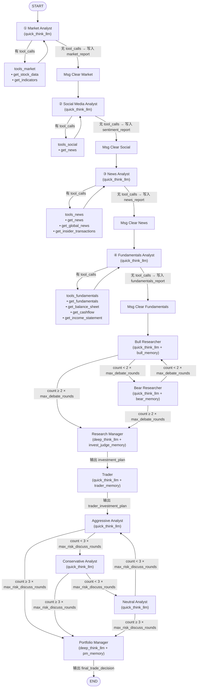

分析师步骤其实偏向：编排式工作流

当前的multi-agent的设计是decentralized

在各个环节注意中间件设计，确保大模型按需求做事不跑偏不幻觉输出结构正确

全程注意推理三明治
### 对比基准

多 agent bot 必须与以下基准进行对比：

- **Buy-and-Hold**：基准指数或 ETF
- **单 agent bot**：无辩论 / 无多角色的原始 TradingAgents
- **传统量化策略**：如动量策略或基于 RSI 的规则策略

### 评估指标

| 指标 | 说明 |
|------|------|
| 年化收益率（Annualized Return / CAGR） | 测试期间的复合年增长率 |
| 波动率（Volatility） | 收益率的标准差 |
| 夏普比率（Sharpe Ratio） | 收益 / 波动率，衡量风险调整后的收益 |
| 最大回撤（Max Drawdown） | 从历史最高点到最低点的最大跌幅 |
| 换手率（Turnover） | 持仓随时间变化的频率或幅度 |
| 交易成本（Transaction Costs） | 交易带来的总成本影响 |

### guideline写明建议

以下方向可获得额外加分：

- **新增 Agent 角色**：如基于宏观经济数据发布的宏观事件预测 agent
- **滚动前向验证（Roll-forward Validation）**：优化滚动窗口以降低过拟合
- **Retrieval Augmented Prompts**：通过向量库注入结构化外部数据
- **多资产组合**：将 TradingAgents 扩展为支持组合管理，而非仅单支股票
- **加密货币市场**：扩展 TradingAgents 支持加密资产交易

### 交付物

- 修改后的 TradingAgents 代码（不能只是复制，需清晰记录改动）
- 数据收集、回测与指标计算脚本
- `requirements.txt` 或 `environment.yml`（确保环境可复现）
- 小型 demo 脚本（展示如何对指定 ticker 和日期运行 bot）
- 支持通过 config 切换模型
- 撰写研究报告并制作演示，将多 agent bot 与经典基准进行对比

# Processing
## 前期数据设计工作

**完成以下的设计即可不用具体实施，写为 spec 技术文档形式**

### 1. 确定测试品种与时间窗口

**选定配置（已写入 `main.py`）：**

| 参数 | 值 | 说明 |
|------|-----|------|
| 股票品种 | `NVDA` | NVIDIA，AI 主题龙头，波动大、新闻丰富，适合情绪 / 基本面 agent 分析 |
| 分析日期 | `2024-05-10` | 英伟达财报季前后，市场情绪复杂，测试价值高 |
| 加密品种 | `BTC` | 比特币，对应 `crypto` analyst，同一日期区间 |
| 可替换选项 | `AAPL 2024-06-15`, `MSFT 2024-07-20` | 均为主流美股，数据完整 |

**运行方式**：直接执行 `python main.py`，其中已预设 NVDA / 2024-05-10 标准配置。

**数据采集模式（结论）：**

> 采用**按需拉取（On-demand Fetch）**，而非预先建立离线数据库。
>
> - 每次运行时，各 Agent 工具函数直接调用 yfinance / CoinGecko / FRED API 获取数据（**实时拉取**）
> - 首次拉取后，数据自动写入 `./data_cache/{category}/{symbol}/{start}_{end}.parquet`（**Parquet 本地缓存**）
> - 后续再次运行时，若缓存命中则跳过 API 调用，类似"懒加载离线库"（**缓存后可离线复用**）
> - **无需预先手动建库**——缓存在 Agent 实际运行过程中自动积累
>
> 实时与离线并不矛盾：首次运行为实时，之后命中缓存即为离线。这是本项目数据层的核心设计选择。

### 2. 扩展数据源

**职责**：负责数据采集层，为 agent 提供**当日/实时**的分析输入。#3 的向量库所需历史数据也由本任务统一采集，#3 直接复用，不重复开发采集逻辑。

- **数据提供商**：从 yfinance 换成 Alpha Vantage、Tiingo、Polygon、新浪财经
- **市场覆盖**：集成港股、A 股、加密货币等市场数据接口（**教授说加密有加分，这个最好要有，别的都行**）
- **数据类型**：增加 alternative data、社交媒体情绪、宏观经济指标

**数据源参考使用**：
- **实时数据源**：
    - Alpha Vantage（免费版）：
        -- 提供股票、外汇、加密货币的实时数据。
        -- 每分钟 5 次请求限制，适合低频实时需求。
    - Tiingo（免费试用）：
        -- 提供股票和外汇的实时数据。
        -- 需要注册 API 密钥。
    - CoinGecko（加密货币）：
        -- 提供加密货币的实时价格、交易量等数据。
        -- 无需 API 密钥，完全免费。
    - 新浪财经（港股、A 股）：
        -- 提供实时行情数据，适合中国市场。
    - **采集**：
        - 职责：采集实时数据，供 Agent 在运行时分析。
        - 实现方式：
            -- 使用 WebSocket 或定时任务定期拉取实时数据。
            -- 数据源：Alpha Vantage、Tiingo、CoinGecko、新浪财经。
- **离线数据源**：
    - Yahoo Finance（yfinance）：
        -- 提供股票的历史数据和技术指标。
        -- 免费且易用，适合离线回测。
    - Quandl（现为 Nasdaq Data Link）：
        -- 提供经济指标、股票历史数据。
        -- 免费数据集有限，但适合离线分析。
    - FRED（美国经济数据）：
        -- 提供宏观经济指标（如利率、CPI）。
        -- 免费且数据质量高。
    - SEC EDGAR：
        -- 提供公司财务报告（10-K、10-Q）。
        -- 免费，适合离线分析。
    - **采集**：
        - 职责：采集历史数据，供回测和向量化检索。
        - 实现方式：
            -- 使用批量请求拉取历史数据。
            -- 数据源：yfinance、Quandl、FRED、SEC EDGAR。

---

### ✅ 已实现方案（2026-03-28）

**原则**：免费优先、零 API Key 优先、自动缓存、#3 直接复用。

#### 数据类型与数据源选型

| 数据类别 | 数据源 | API Key | 实时/离线 | 说明 |
|----------|--------|---------|-----------|------|
| 股票 OHLCV | `yfinance` | 不需要 | 两者 | 已有，保留 |
| 技术指标 | `yfinance` / `alpha_vantage` | 可选 | 两者 | 已有，保留 |
| 基本面 | `yfinance` | 不需要 | 离线 | 已有，保留 |
| 新闻 | `yfinance` | 不需要 | 实时 | 已有，保留 |
| **加密货币** | **CoinGecko** | **不需要** | **两者** | ✅ 新增，重点实现 |
| **宏观经济** | **FRED** | **免费申请** | **离线为主** | ✅ 新增，覆盖利率/CPI/VIX |
| **新闻情绪** | **VADER on yfinance** | **不需要** | **两者** | ✅ 新增，零额外依赖 |
| **社交情绪** | **Reddit PRAW（可选）** | **免费申请** | **实时** | ✅ 新增，不填则降级为新闻情绪 |

#### 日K数据市场覆盖（2026-03-29 确认）

通过 **yfinance 一个库**，只需修改 ticker 格式即可接入以下市场，无需切换数据源：

| 市场 | Ticker 格式示例 | 状态 | 备注 |
|------|----------------|------|------|
| 美股 | `AAPL`, `NVDA` | ✅ 完整 | 主要测试品种 |
| 港股 | `0700.HK` | ✅ 可用 | 加 `.HK` 后缀 |
| A股 | `600519.SS`, `000001.SZ` | ✅ 可用 | 上证加 `.SS`，深证加 `.SZ`；部分数据有缺口 |
| 日股 | `7203.T` | ✅ 可用 | 加 `.T` 后缀 |
| 加密货币 | `BTC`（内部转为 `BTC-USD`）| ✅ 完整 | 24/7 无节假日，无市场间歇 |
| 外汇 | `EURUSD=X` | ⚠️ yfinance 支持 | 框架未封装，需时可扩展 |
| 大宗商品 | `GC=F`（黄金）, `CL=F`（原油）| ⚠️ yfinance 支持 | 同上 |

**结论**：核心测试品种（美股 + 加密货币）已完整覆盖，港股/A股可用但不作为主要测试对象。

#### 实时 vs 离线——问题回答

> **哪种方式免费且不需大量人工维护？**
> 
> - **最优选：按需拉取（On-demand Fetch）**——Agent 运行时直接调用数据函数，无需维护任何定时任务或 WebSocket 连接。yfinance / CoinGecko / FRED 均支持。
> - 定时任务/WebSocket 适合生产级系统，本项目以研究为主，按需拉取即可。

#### 历史数据存储是否必要？

> **必要，但无需数据库**——采用 Parquet 文件缓存：
> - 首次调用 → 写入 `data_cache/{category}/{symbol}/` 目录
> - 后续调用 → 命中缓存则直接返回，跳过 API 调用
> - #3 RAP 向量库直接 `load_dataframe()` 读取，无需重复采集逻辑
> - 文件结构：`data_cache/crypto/BTC/2024-01-01_2024-12-31.parquet`

#### 数据格式标准（口径一致）

所有数据函数统一返回**带 header 注释的 CSV 字符串**（与现有 yfinance 函数一致，供 LLM 直接阅读），同时在内部将 DataFrame 写入 Parquet 缓存（供 #3 使用）。

**标准列命名**（所有 OHLCV 类数据）：

```
date, open, high, low, close, volume
```

**情绪数据标准列**：

```
date, title, sentiment (POSITIVE/NEUTRAL/NEGATIVE), compound, positive, negative
```

**宏观数据标准列**：

```
date, value, series_id, description
```

#### 新增文件清单

| 文件 | 职责 |
|------|------|
| `tradingagents/dataflows/coingecko.py` | CoinGecko 加密货币数据（实时+历史） |
| `tradingagents/dataflows/fred_macro.py` | FRED 宏观经济指标（历史序列+快照） |
| `tradingagents/dataflows/sentiment_utils.py` | VADER 情绪评分（新闻+可选 Reddit） |
| `tradingagents/dataflows/local_cache.py` | Parquet 缓存读写（#3 直接调用） |

#### 配置方式（`default_config.py` / `main.py`）

```python
config["data_vendors"] = {
    "crypto_data": "coingecko",   # 无需 API Key
    "macro_data": "fred",         # 需 FRED_API_KEY（.env）
    "sentiment_data": "vader",    # 无需 API Key
}
```

#### 待补充内容（此实现未覆盖）

- **SEC EDGAR 财务报告采集**：10-K/10-Q 结构化解析（归属 #3，但采集接口可在此加）
- **数据采集脚本（批量历史预加载）**：供 #7 交付物使用，需单独编写
- **降级策略**：当 CoinGecko rate limit 触发时，自动降级到 yfinance 加密报价

#### 社媒评论时间过滤（2026-03-29 确认）

**核心要求**：社媒评论必须能按时间区分，确保回测时不使用未来数据。

| 数据源 | 时间字段 | 过滤机制 | 状态 |
|--------|---------|---------|------|
| yfinance 新闻 | `providerPublishTime`（Unix 时间戳） | 精确过滤到 `[date - lookback_days, date]` 窗口 | ✅ 已实现 |
| Reddit PRAW | `post.created_utc`（Unix 时间戳） | 精确过滤到同一窗口；`time_filter="month"` 仅用于扩大候选集 | ✅ 已修复（原为硬编码 `week`，`date` 参数未生效）|

**已修复 Bug（`sentiment_utils.py`）**：原 `get_reddit_sentiment()` 使用 `time_filter="week"` 硬编码，传入的 `date` 参数未被用于实际时间过滤。修复后改为 `time_filter="month"` 拉取更多候选，再通过 `post.created_utc` 按 `date` 参数精确筛选。

**已知限制**：yfinance `ticker.news` 只返回最近约 8 篇文章，不支持历史查询；历史回测日期较早时情绪数据可能为空，代码中已注释说明。Reddit 时间过滤已精确到日。

---

### 数据流全链路梳理（2026-03-29）

#### 一、数据从采集到决策的完整路径

```
外部 API / 本地缓存
    │
    ▼
dataflows/ 采集层（coingecko.py / fred_macro.py / sentiment_utils.py / y_finance.py 等）
    │  返回格式化 CSV 字符串 + 写 Parquet 缓存
    ▼
interface.py route_to_vendor()  ← 统一路由入口，按 config["data_vendors"] 分配到对应 vendor
    │
    ▼
agents/utils/ 工具层（@tool 函数包装，LangChain Tool 格式）
    │  get_crypto_historical / get_news_sentiment / get_macro_snapshot 等
    ▼
agents/analysts/ 分析师节点（LangGraph 节点，调用 LLM + 工具）
    │  每个 Analyst 将分析报告写入 AgentState 对应字段
    │  market_analyst → state["market_report"]
    │  news_analyst   → state["news_report"]
    │  social_media_analyst / sentiment_analyst → state["sentiment_report"]
    │  fundamentals_analyst → state["fundamentals_report"]
    │  crypto_analyst → state["market_report"]
    │  macro_analyst  → state["news_report"]
    ▼
Bull/Bear Researcher（读取上述报告字段，生成多空辩论）
    │
    ▼
Research Manager（汇总辩论 → investment_plan）
    │
    ▼
Trader（读取 investment_plan + 报告 → trader_investment_plan）
    │
    ▼
Risk Debaters × 3（Aggressive / Conservative / Neutral，读取 trader_investment_plan）
    │
    ▼
Portfolio Manager（读取风险辩论结果 → 最终决策 BUY/HOLD/SELL）
    │
    ▼
SignalProcessor（提取单词决策标签）→ 输出
```

#### 二、各数据类型的具体用途

| 数据类型 | 采集函数 | 消费的 Analyst | 写入字段 | 传递给下游 |
|----------|---------|--------------|---------|-----------|
| 股票日K OHLCV | `get_stock_data` | market_analyst | `market_report` | Bull/Bear/Trader/Risk |
| 技术指标 | `get_indicators` | market_analyst | `market_report` | 同上 |
| 财务报表 | `get_fundamentals/balance_sheet/cashflow/income_statement` | fundamentals_analyst | `fundamentals_report` | 同上 |
| 新闻标题 | `get_news`, `get_global_news` | news_analyst | `news_report` | 同上 |
| 社媒情绪（VADER评分） | `get_news_sentiment`, `get_reddit_sentiment` | sentiment_analyst / social_media_analyst | `sentiment_report` | 同上 |
| 加密货币 OHLCV | `get_crypto_historical`, `get_crypto_price` | crypto_analyst | `market_report` | 同上 |
| 宏观经济指标 | `get_macro_snapshot`, `get_macro_indicator` | macro_analyst | `news_report` | 同上 |
| 历史决策记忆 | BM25 检索 `FinancialSituationMemory` | Bull/Bear Researcher | `investment_debate_state` | Research Manager |

#### 三、数据层潜在问题清单

**P1 — 高优先级（影响回测正确性）**

1. **yfinance 新闻无历史查询能力**
   - 现状：`ticker.news` 仅返回当前最近 ~8 篇，不支持按日期范围拉取历史新闻
   - 影响：回测历史日期时（如 2024-05-10），新闻情绪数据可能为空或返回的是今天的新闻
   - 后果：情绪分析在历史回测中基本失效，sentiment_report 字段为空，下游辩论缺少情绪输入
   - 状态：⚠️ **待解决** — 代码已注释说明此限制；严格历史回测需接入 NewsAPI / GNews（有免费层，支持 30 天历史），超出当前任务范围

2. **CoinGecko 免费 API 限速严重**
   - 现状：公共端点无 API Key 时限速约 10-30 req/min，当 crypto analyst 连续调用多个工具时极易触发
   - 影响：工具调用失败或需等待 60 秒，整个 Agent 推理链中断
   - 状态：⚠️ **部分缓解** — `get_crypto_historical` 已优先走 yfinance（`BTC-USD`），CoinGecko 只用于实时快照；`_cg_get()` 已有 429 指数退避重试（等待 60s）。回测脚本建议跳过 `get_crypto_price` 实时快照工具调用，只用 `get_crypto_historical`

3. **FRED 数据发布存在滞后（Reporting Lag）**
   - 原状：宏观指标（如 CPI）通常滞后 2-6 周发布，`get_macro_snapshot` 和 `get_macro_indicator` 未区分"发布日"与"数据日"
   - 影响：回测中可能使用了当时尚未公开的数据（未来泄漏），在严格 Walk-forward 验证中违规
   - 状态：✅ **已修复（2026-03-29）** — `fred_macro.py` 所有 `fred.get_series()` 调用均加入 `realtime_start=date, realtime_end=date` 参数，FRED API 自动只返回该日期前已公开发布的数据，消除未来泄漏

4. **social_media_analyst 与 sentiment_analyst 写入同一字段冲突**
   - 原状：两者都写 `state["sentiment_report"]`，同时选入时后执行的覆盖前者，一份报告被静默丢弃
   - 状态：✅ **已修复（2026-03-29）** — `social_media_analyst` 改写 `state["community_report"]`（社区舆情脉冲）；`sentiment_analyst` 保持写 `state["sentiment_report"]`（VADER 定量评分）；`AgentState` 新增 `community_report` 字段；8 个下游节点（bull/bear researcher、research_manager、portfolio_manager、trader、3×风险辩手）均增加读取 `community_report` 并条件性拼入 `curr_situation`

5. **crypto_analyst 与 market_analyst 写入同一字段冲突**
   - 原状：两者都写 `state["market_report"]`，同时选中时后者覆盖前者
   - 状态：✅ **已修复（2026-03-29）** — `crypto_analyst` 改写 `state["crypto_report"]`；`AgentState` 新增 `crypto_report` 字段；所有下游节点同步更新，条件性读取并拼入 `curr_situation`

**P2 — 中优先级（影响数据完整性）**

6. **Parquet 缓存无版本控制**
   - 现状：缓存文件名为 `{start}_{end}.parquet`，若同一日期范围的数据被更新（如 yfinance 回填历史），旧缓存不会自动失效
   - 建议：写缓存时附加数据源版本或写入时间戳，提供 `--force-refresh` 标志

7. **加密货币 Ticker 映射表覆盖不全**
   - 现状：`CRYPTO_ID_MAP` 仅预置 15 个主流币，其余 ticker 通过 `upper().lower()` 猜测 CoinGecko ID，高概率失败
   - 建议：接入 CoinGecko `/coins/list` 动态构建映射，或给出明确错误提示

8. **macro_analyst 与 news_analyst 写入同一字段**
   - 同 P1-4/5 同类问题：macro_analyst 写 `state["news_report"]`，与 news_analyst 冲突
   - 建议：macro_analyst 写入 `state["macro_report"]`

**P3 — 低优先级（可接受的已知限制）**

9. **Reddit 仅能查询近 1 个月内的帖子**（PRAW `time_filter` 最长为 `year`，但实际可用历史有限）
10. **yfinance A股/港股数据存在缺口**（如停牌日、ST股退市等特殊情况未处理）
11. **技术指标需足够历史数据预热**（如 200-SMA 需要至少 200 天数据，若传入窗口不足会产生 NaN）


> **与 #3 的分工边界**：本任务只做数据接入与存储，不涉及向量化；宏观指标、情绪数据等同时被 #2（实时输入）和 #3（历史检索）使用，采集接口统一在此定义，#3 直接调用。

---

#### Agent 层集成（完整实现记录，2026-03-28）

除数据采集层外，同步完成了 Agent 层的完整接入，使新数据源可被 LangGraph 工作流中的 LLM 直接调用。

##### 新增工具文件（`tradingagents/agents/utils/`）

| 文件 | 包含 LangChain `@tool` | 说明 |
|------|------------------------|------|
| `crypto_tools.py` | `get_crypto_price`, `get_crypto_historical`, `get_crypto_market_overview` | 代理调用 `route_to_vendor()` → CoinGecko / yfinance |
| `macro_tools.py` | `get_macro_indicator`, `get_macro_snapshot`, `list_available_macro_series` | 代理调用 → FRED |
| `sentiment_tools.py` | `get_news_sentiment`, `get_reddit_sentiment` | 代理调用 → VADER |

##### 新增 Analyst Agent 文件（`tradingagents/agents/analysts/`）

| 文件 | 写入字段 | 绑定工具 |
|------|----------|----------|
| `crypto_analyst.py` | `state["crypto_report"]`（原为 `market_report`，已修复字段冲突） | `get_crypto_price`, `get_crypto_historical`, `get_crypto_market_overview`, `get_macro_snapshot` |
| `sentiment_analyst.py` | `state["sentiment_report"]` | `get_news`, `get_news_sentiment`, `get_reddit_sentiment` |
| `macro_analyst.py` | `state["news_report"]` | `get_macro_snapshot`, `get_macro_indicator`, `list_available_macro_series` |

##### 修改的现有文件

| 文件 | 变更内容 |
|------|--------|
| `tradingagents/dataflows/interface.py` | 新增 `crypto_data` / `macro_data` / `sentiment_data` VENDOR 类别；注册 8 个新函数的路由映射 |
| `tradingagents/default_config.py` | `data_vendors` 新增 `crypto_data: coingecko`, `macro_data: fred`, `sentiment_data: vader`；新增 `data_cache_enabled` / `data_cache_dir` |
| `.env.example` | 新增 `FRED_API_KEY`, `REDDIT_CLIENT_ID`, `REDDIT_CLIENT_SECRET`, `REDDIT_USER_AGENT`, `TRADEHIVE_CACHE_DIR` |
| `tradingagents/agents/utils/agent_utils.py` | 导入 9 个新工具（crypto / macro / sentiment tools） |
| `tradingagents/agents/__init__.py` | 导出 `create_crypto_analyst`, `create_sentiment_analyst`, `create_macro_analyst` |
| `tradingagents/graph/conditional_logic.py` | 新增 `should_continue_sentiment()`, `should_continue_crypto()`, `should_continue_macro()` |
| `tradingagents/graph/trading_graph.py` | 新增 `sentiment` / `crypto` / `macro` 三个 ToolNode；导入 9 个新工具 |
| `tradingagents/graph/setup.py` | `setup_graph()` 增加对 `"sentiment"`, `"crypto"`, `"macro"` 的节点注册与边连接 |
| `pyproject.toml` | 新增依赖：`fredapi>=0.5.1`, `vaderSentiment>=3.3.2`, `pyarrow>=14.0.0`, `praw>=7.7.0` |
| `main.py` | 新增注释形式的使用示例（加密货币分析 / 全量分析），原 NVDA 标准流程不变 |

##### selected_analysts 可用值（新旧对比）

```python
# 原有（保持不变）
["market", "social", "news", "fundamentals"]

# 新增（3 个）
["crypto", "sentiment", "macro"]

# 示例组合：加密货币分析
selected_analysts = ["crypto", "sentiment", "fundamentals"]

# 示例组合：全量分析（含宏观加分项）
selected_analysts = ["market", "social", "news", "fundamentals", "sentiment", "crypto", "macro"]
```

##### 依赖安装

```bash
pip install fredapi vaderSentiment pyarrow praw yfinance
```

> `yfinance` 为加密货币历史数据的主要来源（BTC-USD / ETH-USD），CoinGecko 仅用于实时快照。

### 3. RAP 向量库外部数据（需支持回测的历史数据）

**职责**：负责向量化索引与检索逻辑，数据采集依赖 #2，不重复实现。

RAP 的核心是”按需检索”而非把所有数据塞进 prompt——当 agent 分析 NVDA 时，从向量库找出历史上最相似的市场条件下的决策记录，注入当前 prompt，让 LLM 有参照。

候选数据源（采集由 #2 负责，本任务负责向量化入库与检索）：

- **宏观经济指标**：利率、CPI、非农数据等时序数据 → 历史序列向量化，按相似市场条件检索
- **财务报告 / SEC 文件**：10-K、10-Q 等结构化财务数据，按 ticker + 时间索引入向量库（无实时需求，采集也归本任务）
- **分析师研报**：外部机构研报、评级变更，结构化后按相关性检索注入 prompt（无实时需求，采集也归本任务）
- **历史情绪数据**：社交媒体情绪历史记录，离线入库后按相似市场条件检索

### 4. 多资产组合设计

（教授建议）将 TradingAgents 从单支股票扩展为支持组合管理。

**设计方案（Spec）：**

**核心扩展点：** 当前系统每次 `propagate(ticker, date)` 只分析一支股票，输出"买 / 卖 / 持有"决策。多资产组合扩展后，输出仓位权重向量，如 `{NVDA: 0.4, BTC: 0.3, AAPL: 0.3}`。

**工作流变更：** 外层 for loop 对每支股票分别运行分析师节点 → 汇总各 ticker 报告 → Portfolio Manager 生成权重分配（含相关性、波动率计算）

**约束：** LLM 上下文窗口限制（多报告拼接需摘要压缩）；可用 asyncio 并行各 ticker 减少耗时。

### 5. 滚动前向验证（Roll-forward Validation）

优化滚动窗口以降低过拟合。

**设计方案（Spec）：**

**目标**：前向验证（Walk-forward Testing）避免未来数据泄漏（Look-ahead Bias）。

**验证流程（步长 = 1月）：**

| 训练窗口 (In-sample) | 验证窗口 (Out-of-sample) |
|---|---|
| 2023-01-01 ~ 2023-12-31 | 2024-01-01 ~ 2024-03-31 |
| 2023-04-01 ~ 2024-03-31 | 2024-04-01 ~ 2024-06-30 |
| 2023-07-01 ~ 2024-06-30 | 2024-07-01 ~ 2024-09-30 |

**防泄漏控制：** yfinance / CoinGecko 按日期查询天然不泄漏；VADER 用 `lookback_days` 控制窗口；FRED 使用 `realtime_start` 参数；Agent 长期记忆仅在训练期积累，验证期只读不写。

### 6. 对多 agent 策略结果进行严格的金融回测与评估

**设计方案（Spec）：**

**回测伪代码：**

```python
def run_backtest(ticker, start_date, end_date, config):
    date_range = get_trading_days(start_date, end_date)
    portfolio = {"cash": 100_000, "position": 0, "history": []}
    for date in date_range:
        _, decision = ta.propagate(ticker, date)
        action = parse_decision(decision)  # "buy" / "sell" / "hold"
        portfolio = execute_trade(portfolio, action, get_price(ticker, date))
    return compute_metrics(portfolio)
```

**评估指标：** CAGR = `(final/initial)^(252/n)-1`；夏普比率 = `(CAGR-0.05)/vol`；最大回撤 = `max(1-value/rolling_max)`；波动率 = `std(daily_returns)*sqrt(252)`

**对比基准：** Buy-and-Hold / 单 Agent Bot（无辩论）/ 动量策略（20日均线穿越）

### 7. 交付脚本数据收集/回测/计算，以及demo演示脚本

**已完成（可直接使用）：Demo 脚本 `main.py`** — 展示如何对 NVDA/2024-05-10 运行完整多 agent 分析

```bash
cp .env.example .env          # 填写 OPENAI_API_KEY 等
pip install -e ".[dev]"
pip install fredapi vaderSentiment pyarrow praw yfinance
python main.py
```

**待实现（Spec）：**

- **数据预加载脚本** `scripts/fetch_data.py`：批量拉取 OHLCV/情绪/宏观数据写入 `data_cache/`，支持参数 `--tickers NVDA BTC --start 2024-01-01 --end 2024-12-31`
- **回测脚本** `scripts/backtest.py`：跨日期调用 `propagate()`，输出 6 项指标，与基准对比


## 我的设计工作

### 1. Agent 角色设计修改


#### 1.4 是否新增会议主持者角色


### 2. Agent机制设计修改
#### 2.1 Agent自验证循环探究改进：
如何避免死循环：中间件是否跟踪了文件编辑次数，超过阈值则提醒重新审视？
如何避免跳过验证：中间件强制执行玩这个验证

#### 2.2 multi-agent(agent)自主决策:辩论轮数限制是否要修改，终止循环是否应该自己判断

#### 2.3 动态交互:多agent阶段是否应该自由交互

#### 2.4 设计单agent和多agent系统tools暴露机制，实验性加入更多


### 3. 长期记忆修改
#### 3.1 新增持久化记忆存储
**原始限制（已规划改进）**：
- ~~`FinancialSituationMemory` 只在内存中存储，进程重启后归零，无磁盘持久化~~ → **改进方向：ChromaDB 本地持久化，启动时自动加载**
- ~~BM25 是词频匹配，无法捕捉语义关联（如"利率攀升"和"加息周期"）~~ → **改进方向：加入稠密向量检索，BM25 + 向量 RRF 混合**
升级记忆系统为混合检索 + 磁盘持久化：BM25（词汇匹配）+ 稠密向量检索（语义匹配），结果通过 RRF 融合后注入 prompt；记忆数据持久化到本地向量库（ChromaDB），重启后不丢失；保留冷启动保护策略（memory_warmup_runs）


#### 3.2 新增辩手记忆
**：为风险辩手补充记忆**：当前 Aggressive/Conservative/Neutral 三个风险辩手没有记忆（DEV_SPEC 已标记为不对称问题），而投资辩论的 Bull/Bear 有独立记忆池。应为风险辩手新增 `aggressive_memory`、`conservative_memory`、`neutral_memory` 三个 `FinancialSituationMemory` 实例，使风险辩论也能从历史决策中学习。同时确保 Single-Agent 对比实验中该阶段有记忆维度的对比价值。


#### 3.3 部分记忆机制重构
记忆功能冷启动策略，设置合理轮数不使用长期记忆，积累到一定阈值后开放查询


### 4. 上下文管理重构
#### 4.1 上下文隔离
**现状评估**：现有系统已有三层部分隔离：

1. **Msg Clear（消息清理节点）**：每个 Analyst 节点完成后（报告生成 or tool call 循环结束），经过 `Msg Clear {Analyst}` 节点，删除 `state["messages"]` 中所有消息并注入 "Continue" 占位符（Anthropic 模型要求 messages 非空）。防止某个 Analyst 的多轮工具调用历史（tool call / tool result 消息串）累积到下一个 Analyst 的上下文里。Msg Clear 仅在**相邻两个 Analyst 之间**起作用。

2. **辩论阶段绕过 `messages`**：Analyst 阶段通过 `chain.invoke(state["messages"])` + MessagesPlaceholder 传入 LLM 上下文；而 Bull/Bear Researcher、三个风险辩手、Research Manager、Portfolio Manager、Trader 全部**不读取** `state["messages"]`，而是从具名字段手动构建 prompt 后直接 `llm.invoke(prompt)` 调用，与 Analyst 阶段的 messages 上下文完全切断。

3. **具名嵌套字段（InvestDebateState、RiskDebateState）**：辩论内部状态不写入扁平 messages，而是封装为两个嵌套 TypedDict。`InvestDebateState` 含 `bull_history`、`bear_history`、`history`、`current_response`、`judge_decision`、`count`；`RiskDebateState` 含三个辩手独立 history 字段、`latest_speaker`、三个 `current_*_response`、`judge_decision`、`count`。每个辩手只更新自己所在的子状态对象，辩论历史按角色分开追踪，互不覆盖。

但上述隔离仍存在以下核心问题：
- 所有 agent 共享同一个扁平 `AgentState`，无访问控制，任意 agent 可读任意字段，靠编写时自觉维护

**方案：字段白名单（AGENT_FIELD_PERMISSIONS）**
在一个集中位置定义每个 agent 允许读取的字段白名单，在节点入口做提取/校验，超出授权范围的字段不传给 LLM。字段本身即防火墙，无需引入父子 agent 结构。

优先选择白名单而非分层 State 结构的原因：改动小，现有架构基本不变；隔离语义集中可查；后续若 agent 数量大幅增加再考虑迁移分层 State。

**各 agent 授权字段（待实现）**：

| Agent | 允许读取的字段 |
|-------|--------------|
| Market / Social / News / Fundamentals Analyst | `messages`、`company_of_interest`、`trade_date` |
| Bull / Bear Researcher | `market_report`、`sentiment_report`、`news_report`、`fundamentals_report`、`investment_debate_state`、`company_of_interest` |
| Research Manager | `market_report`、`sentiment_report`、`news_report`、`fundamentals_report`、`investment_debate_state`、`company_of_interest` |
| Trader | `investment_plan`（Research Manager 输出）、`market_report`、`sentiment_report`、`news_report`、`fundamentals_report`、`company_of_interest` |
| Aggressive / Conservative / Neutral Debater | `trader_investment_plan`、`market_report`、`sentiment_report`、`news_report`、`fundamentals_report`、`risk_debate_state` |
| Portfolio Manager | `risk_debate_state`、`investment_plan`、`market_report`、`sentiment_report`、`news_report`、`fundamentals_report`、`company_of_interest` |

> **注（Trader）**：Trader 的 LLM 调用不读取 `state["messages"]`（与辩论阶段一样绕过 messages，自行构造新 messages 列表传入 `llm.invoke`），但其返回值会写回 `state["messages"]`。上表约束的是**注入 LLM 的字段**，写回行为不受白名单限制，实现时无需特殊处理。

> **注（Portfolio Manager）**：代码中 Portfolio Manager 读取的是 `state["investment_plan"]`（Research Manager 的输出），并非 Trader 的 `trader_investment_plan`。当前命名在代码里存在歧义（portfolio_manager.py 将其称为 `trader_plan`），表格如实反映现有代码行为。

**待办**：实现 `AGENT_FIELD_PERMISSIONS` 字典并在节点入口添加字段提取逻辑。


#### 4.2 上下文压缩(还需完善思考设计)
提高能力，智能保留防止关键信息丢失
##### 核心思路：上下文管理的七个生命周期决策（参考 OpenClaw 3.7 ContextEngine）
   这些决策加在一起决定了整个系统的"智商上限"——不是模型的智商，是系统的智商。

   | 钩子 | 时机 | 决策 |
   |------|------|------|
   | **bootstrap** | Agent 启动 | 加载什么初始信息 |
   | **ingest** | 新消息进入 | 原样存储还是预处理/过滤关键部分 |
   | **assemble**（最核心） | 调用模型时 | 从所有可用信息中选什么送入上下文窗口（100 条历史、20 个工具输出、5 个外部文档，窗口只够三分之一，选什么？） |
   | **compact** | 上下文接近上限 | 压缩策略——摘要粒度、哪些信息不可丢弃 |
   | **afterTurn** | 模型回复完成 | 哪些中间结果持久化到磁盘、哪些丢弃 |
   | **prepareSubagentSpawn** | 子 Agent 启动 | 传递什么上下文给子 Agent |
   | **onSubagentEnded** | 子 Agent 结束 | 如何回收成果到父 Agent 的上下文 |

##### 压缩机制与风险
   **触发条件（OpenClaw 方案）：**
   - **溢出恢复**：模型返回上下文溢出错误时触发压缩并重试
   - **阈值维护**：任务成功完成后，检测到 token 超过预留阈值时触发

   **核心风险——关键指令丢失：**
   - 典型案例：用户让 Agent 处理收件箱数千条消息，压缩后"在我说可以之前不要做任何事"的指令从摘要中消失，Agent 回到自主模式开始删除邮件，造成灾难性后果
   - 策略因场景而异：编码 Agent 和邮件处理 Agent 的上下文管理策略完全不同，没有通用答案
   - 因此 OpenClaw 3.7 将上下文管理变成可插拔接口（ContextEngine 插件槽位），LegacyContextEngine 包装器保留原有行为，新插件可获得全部控制权

##### 参考案例：Lossless-Claw 插件
   - **问题**：简单摘要压缩是有损的，可能丢失关键信息
   - **方案**：激进压缩 + 保留指向原始数据的"无损指针"，原始消息始终保留在数据库中，摘要链接回源消息
   - **工具**：`lcm_grep`（搜索）、`lcm_describe`（描述）、`lcm_expand`（展开恢复原始细节）
   - **启示**：上下文管理策略可插件化，不改核心循环一行代码即可替换，让 Agent "过目不忘"

##### 对 TradeHive 的启发
   当前 `create_msg_delete()` 是简单清除消息防 token 溢出，可探索更智能的上下文保留/压缩机制


### 5. prompt构造优化
- 四份原始报告被所有后续 agent 无损重复注入（辩论每轮都重新拼入），无压缩无隔离：**辩论阶段报告重复注入优化**：当前辩手每轮调用都从 state 重新取四份完整报告拼入 prompt，报告内容不变却随轮次线性重复。改进思路：仅在辩论第一轮（`count == 0`）注入完整报告，后续轮次只追加辩论发言内容（`history`），减少冗余 token。默认1轮配置下影响有限，辩论轮数增大时收益显著。


### 6. 保证数据流结构化输出
#### 6a. 当前数据流（现状文档）

当前数据流：

##### 全局只读字段（初始化写入，全程不变）

| 字段 | 内容 | 读取者 |
|------|------|--------|
| `company_of_interest` | ticker 字符串（如 `"AAPL"`） | 分析师、Trader、Research Manager、Portfolio Manager |
| `trade_date` | 交易日期字符串 | 仅四个分析师 |

---

##### 阶段一：分析师 → 后续所有阶段

四个分析师串行执行，各自写入一个报告字段；每个分析师完成后 Msg Clear 节点清除 `messages`，报告字段不受影响。

| 字段 | 写入者 | 读取者 |
|------|--------|--------|
| `market_report` | Market Analyst | Bull/Bear、Research Manager、Trader、Aggressive/Conservative/Neutral、Portfolio Manager |
| `sentiment_report` | Social Analyst | 同上 |
| `news_report` | News Analyst | 同上 |
| `fundamentals_report` | Fundamentals Analyst | 同上 |
| `messages` | 分析师（tool call/result/报告）| 同一分析师内部循环；Msg Clear 节点清除 |

---

##### 阶段二：投资辩论（Bull/Bear → Research Manager）

通过 `investment_debate_state` 嵌套结构传递，完全绕过 `messages`：

| 字段（父：`investment_debate_state`） | 写入者 | 读取者 | 说明 |
|--------|--------|--------|------|
| `investment_debate_state.history` | Bull/Bear 每轮追加 | Bull/Bear、Research Manager | 完整辩论上下文 |
| `investment_debate_state.bull_history` / `bear_history` | Bull/Bear 各自追加 | 无实际消费者 | 冗余字段 |
| `investment_debate_state.current_response` | Bull/Bear 各自覆写 | Bear 用于反驳 Bull；条件路由判断轮序 | Research Manager 最终也会覆写此字段（语义破坏，但辩论已结束不影响运行） |
| `investment_debate_state.count` | Bull/Bear 每次 +1 | 条件路由截止判断 | 裁判不递增 |
| `investment_debate_state.judge_decision` | Research Manager | 无下游消费者 | 冗余，实际决策通过 `investment_plan` 传递 |

---

##### 阶段三：Research Manager → Trader / 风险辩论

| 字段 | 写入者 | 读取者 |
|------|--------|--------|
| `investment_plan` | Research Manager | Trader、Portfolio Manager（Bug：Portfolio Manager 将此字段标注为 "Trader's proposed plan"，实为 Research Manager 输出） |

---

##### 阶段四：Trader → 风险辩论

| 字段 | 写入者 | 读取者 |
|------|--------|--------|
| `trader_investment_plan` | Trader | Aggressive / Conservative / Neutral 三个风险辩手（均读取此字段作为"trader_decision"注入 prompt） |
| `messages` | Trader（写入 AIMessage） | 无下游消费者（冗余写入） |
| `sender` | Trader（写入 `"Trader"`） | 无下游消费者（冗余写入） |

注意：Portfolio Manager **不**读 `trader_investment_plan`，而是读 `investment_plan`（Research Manager 输出），是已知 Bug。

---

##### 阶段五：风险辩论（Aggressive/Conservative/Neutral → Portfolio Manager）

通过 `risk_debate_state` 嵌套结构传递，结构与投资辩论对称：

| 字段（父：`risk_debate_state`） | 写入者 | 读取者 | 说明 |
|--------|--------|--------|------|
| `risk_debate_state.history` | 三方辩手各自追加 | 三方辩手、Portfolio Manager | 完整辩论上下文 |
| `risk_debate_state.aggressive_history` / `conservative_history` / `neutral_history` | 各自追加 | 无实际消费者 | 冗余字段 |
| `risk_debate_state.current_aggressive_response` / `current_conservative_response` / `current_neutral_response` | 各辩手覆写最新发言 | 其他两方辩手用于针对性反驳 | 三方互相读取对方最新发言 |
| `risk_debate_state.latest_speaker` | 各辩手写自己名字 | 条件路由决定下一个发言者 | |
| `risk_debate_state.count` | 三方辩手各 +1 | 条件路由截止判断 | 裁判不递增 |
| `risk_debate_state.judge_decision` | Portfolio Manager | 无下游消费者 | 冗余，实际决策通过 `final_trade_decision` 传递 |

---

##### 阶段六：Portfolio Manager → 最终输出

| 字段 | 写入者 | 读取者 |
|------|--------|--------|
| `final_trade_decision` | Portfolio Manager | 图的最终输出，供外部调用者读取 |

---

##### 信息流总览（单向漏斗）

```
初始化
  └─ company_of_interest / trade_date（全程只读）

分析师阶段（串行）
  └─ market_report / sentiment_report / news_report / fundamentals_report
        │
        ├──→ Bull / Bear 辩论
        │       └─ investment_debate_state.history
        │               └─ Research Manager
        │                       └─ investment_plan
        │                               ├──→ Trader
        │                               │       └─ trader_investment_plan
        │                               │               └─ Aggressive/Conservative/Neutral 辩论
        │                               │                       └─ risk_debate_state.history
        │                               │                               └─ Portfolio Manager
        │                               │                                       └─ final_trade_decision ✓
        │                               │
        │                               └──→ Portfolio Manager（Bug：误读为 trader_plan）
        │
        └──→ Trader / Research Manager / Portfolio Manager（四份报告直接注入）
```

#### 6.b 约束策略（还需修改）


##### 方法分级（按可靠性从高到低）
**Level 1：API 层强制约束（最可靠，优先实现）**
- **Structured Output / JSON Schema 模式**：在 API 调用时直接传入 JSON Schema，模型在 token 生成层面被约束，无法输出不符合 schema 的结构。Anthropic / OpenAI 均支持。
- **Tool calling 作为输出载体**：把期望的输出结构定义为一个 tool，让模型"调用"该 tool 来返回结果。本质是语法层面的约束，比 prompt 指令强得多。

**Level 2：库层约束**
- **`instructor` 库**：封装 LLM 调用 + Pydantic 验证 + 自动重试，失败时自动把校验错误 feedback 回模型重试。三行代码让任意 LLM 输出 Pydantic model，TradeHive 里最实用。
- **LangChain `with_structured_output()`**：已内置，底层是 tool calling 或 JSON mode，可直接使用。

**Level 3：Prompt 层约束（可靠性最低，作为兜底辅助）**
- **Few-shot**：在 prompt 中提供 2-3 个格式示例，对复杂嵌套结构有辅助作用。
- **格式指令**：明确写"仅输出有效 JSON，不加 markdown，不加解释"。
- **兜底验证节点**：解析输出，失败则将错误 feedback 回模型重试（可建为单独的 LangGraph 节点）。

##### 原有三个举措的重新定位

| 举措 | 必要性 | 定位调整 |
|------|--------|----------|
| 提示词 few-shot | 中 | 降级为 Level 3 辅助，不作为主要依赖 |
| tool 硬限制 | **高** | 升级为 Level 1 优先实现（structured output / tool calling） |
| 兜底验证 | 中高 | 保留，但仅守 `final_trade_decision` 终点，其他节点失败影响有限 |

注意：使用 structured output 时需评估是否限制模型自由度（如报告类输出不宜过度约束格式，决策类输出才需硬限制）。

##### TradeHive 实施优先级

```
1. 用 structured output / tool calling 约束关键决策节点输出
   优先节点：Research Manager → investment_plan
             Portfolio Manager → final_trade_decision

2. 为关键字段定义 Pydantic schema，接入 instructor 或 with_structured_output()

3. 兜底验证只针对 final_trade_decision（终点最重要）

4. few-shot 作为 prompt 辅助，不作为主要依赖
```

### 7. 选便宜又强的模型跑 baseline （后续确认对比细节运行）

### 8. 单 agent 设计，跑单 agent baseline 


### 目前的上下文管理策略：

---

#### A. 主状态结构（LangGraph `MessagesState`）

[agent_states.py](tradingagents/agents/utils/agent_states.py) 使用 TypedDict 扩展 LangGraph 的 `MessagesState`，将各阶段产物（分析报告、辩论历史）存为独立具名字段，而非全堆入 `messages` 列表。核心字段：
- `company_of_interest`（`str`）：目标股票 ticker
- `trade_date`（`str`）：交易日期
- `sender`（`str`）：发送消息的 agent 名称（仅 Trader 写入，实际无下游消费者）
- `market_report` / `sentiment_report` / `news_report` / `fundamentals_report`：各分析师输出
- `investment_debate_state`（`InvestDebateState`）：Bull/Bear 辩论状态，含 `bull_history`、`bear_history`、`history`、`current_response`、`judge_decision`、`count`
- `risk_debate_state`（`RiskDebateState`）：风险辩论状态，含 `aggressive_history`、`conservative_history`、`neutral_history`、`history`、`latest_speaker`、`current_aggressive_response`、`current_conservative_response`、`current_neutral_response`、`judge_decision`、`count`
- `investment_plan`、`trader_investment_plan`、`final_trade_decision`：各决策阶段输出

初始状态由 [propagation.py](tradingagents/graph/propagation.py) 的 `create_initial_state()` 构建：`messages` 初始化为 `[("human", company_name)]`，所有报告字段为空字符串，两个 debate state 的 `count` 初始化为 0、所有历史字段初始化为空字符串。`sender`、`investment_plan`、`trader_investment_plan`、`final_trade_decision` 四个字段**不在**初始状态中，由各 agent 在运行时首次写入；图拓扑保证写入先于读取。

---

#### B. 各阶段上下文策略

##### B1. 分析师阶段：messages 内部累积 + 阶段间统一清除

分析师（market/social/news/fundamentals）使用 `ChatPromptTemplate` + `MessagesPlaceholder`，读取完整 `state["messages"]`，同时读取 `state["trade_date"]` 作为当前日期注入 prompt、通过 `build_instrument_context(state["company_of_interest"])` 注入 ticker 身份。四个分析师共享同一个"协作助手"模板外壳（含 `FINAL TRANSACTION PROPOSAL: **BUY/HOLD/SELL**` 前缀指令），仅 `system_message`（领域 prompt）和绑定工具不同。

- **节点内部**：工具调用循环期间，tool call 与 tool result 在 messages 里逐轮累积，让 LLM 知道已取了哪些数据
- **节点之间**：分析师输出最终报告（无 tool_calls）后，`Msg Clear` 节点用 `RemoveMessage` 删掉所有消息，仅保留占位符 `HumanMessage("Continue")`，防止多个分析师的消息叠加撑爆上下文窗口
- **执行顺序**：按 `selected_analysts` 列表顺序严格串行（默认 market → social → news → fundamentals），每个分析师的 Msg Clear 连接到下一个，最后一个连接到 Bull Researcher
- **轮次控制**：工具调用循环**没有硬性轮次限制**，完全依赖 LLM 自主判断何时停止（不输出 tool_calls 则结束）。唯一保护是全局 `recursion_limit=100`，若 LLM 持续调用工具会触发递归上限报错而非优雅截止

##### B2. 辩论阶段：双层上下文结构，完全绕过 messages

Bull/Bear 辩论和风险评估辩论完全绕过 `state["messages"]`（不读也不写），通过字符串字段手动管理，形成两层结构：
- **全量历史层**（`history`）：每轮发言追加拼接，注入 LLM 获得完整辩论上下文
- **最新一轮层**（`current_response` / `current_aggressive_response` 等）：只保存各方最新一轮发言，注入 LLM 用于定向反驳，路由逻辑也依赖此字段（`current_response.startswith("Bull")` 决定下一个发言者；`latest_speaker` 决定风险辩论轮序）

这种双层设计使 LLM 既能看到完整辩论脉络，又能精确聚焦到需要反驳的对手最新观点。

**轮次控制**（[conditional_logic.py](tradingagents/graph/conditional_logic.py)）：通过 `count` 计数器强制截止——
- 投资辩论：默认最多 1 轮（2 次发言，Bull → Bear → Research Manager），截止条件 `count >= 2 * max_debate_rounds`
- 风险讨论：默认最多 1 轮（3 次发言，3 个角色各一次 → Portfolio Manager），截止条件 `count >= 3 * max_risk_discuss_rounds`
- `count` 递增语义：辩论双方/三方每次发言 `count += 1`，裁判不递增，count 只统计辩论发言次数

##### B3. Trader / Manager：绕过 messages，手动构建 prompt

这三个 agent 构建 prompt 时完全不读 `state["messages"]`，只从 state 具名字段（报告、辩论历史、memory）取内容，上下文窗口精确可控。
- **Trader**：读 `investment_plan`（Research Manager 输出），写回 `messages` 和 `sender`（实际无下游消费者，属无效写入）。调用方式不对称：Trader 是唯一使用 message list（system/user role 分离）调用 LLM 的 agent，其余非分析师 agent 都使用 `llm.invoke(prompt_string)` 直接传字符串。Trader 也是唯一显式处理空记忆的 agent（`if past_memories:` + fallback），其余 agent 空记忆时 `past_memory_str` 为空字符串
- **Research Manager**：不读/写 messages；输出双写到 `investment_debate_state.judge_decision` 和 `investment_plan`。同时将 `current_response` 覆写为裁判决策文本——虽然辩论已结束不影响路由，但破坏了 `current_response` 的语义一致性
- **Portfolio Manager**：不读/写 messages；读取 `state["investment_plan"]`（Research Manager 的输出）并命名为 `trader_plan`，标注为 "Trader's proposed plan"——实际从未读取 `state["trader_investment_plan"]`（真正的 Trader 输出），是一处设计 bug

---

#### C. 跨切面机制

##### C1. 两档 LLM 分层处理

[trading_graph.py](tradingagents/graph/trading_graph.py) 初始化两个 LLM 实例：
- **`deep_thinking_llm`**（高推理强度）：仅分配给 Research Manager 和 Portfolio Manager 两个终审裁判节点，它们接收已经压缩过的辩论历史 `history`，需要从中提炼最终决策
- **`quick_thinking_llm`**（次级推理）：其余所有 agent（四个分析师、Bull/Bear、风险三方辩手、Trader），以及 Reflection 反思阶段

体现"推理三明治"思路：在上下文被充分蒸馏后，才动用高推理强度模型做最终判断。

##### C2. 跨运行长期记忆（BM25 检索）

[memory.py](tradingagents/agents/utils/memory.py) 用 **BM25** 算法存储"过去情境 → 建议"对，不调 API。每次运行取 top-2 相似记忆，但注入 prompt 时**只传 `recommendation`（反思教训文本），丢弃 `matched_situation`（原始情境描述）**，LLM 无法看到匹配的原始情境是什么，只看到结论建议。

**存储结构**：每条记忆是 `(situation, recommendation)` 键值对，分别存入两个 Python list（`documents` + `recommendations`），BM25 索引基于 `documents` 构建，每次写入后重建索引。

**五个独立记忆池及各自反思内容**：

| 记忆池 | 反思时读取的决策内容 | 注入的 agent |
|--------|--------------------|----|
| `bull_memory` | `investment_debate_state.bull_history`（Bull 全部发言） | Bull Researcher |
| `bear_memory` | `investment_debate_state.bear_history` | Bear Researcher |
| `trader_memory` | `trader_investment_plan` | Trader |
| `invest_judge_memory` | `investment_debate_state.judge_decision` | Research Manager |
| `portfolio_manager_memory` | `risk_debate_state.judge_decision` | Portfolio Manager |

**写入机制**：运行结束、得知真实收益后，由 [reflection.py](tradingagents/graph/reflection.py) 的 `Reflector` 统一触发。对每个 agent，将其决策内容 + 四份报告 + 真实收益传给 `quick_thinking_llm` 生成反思文本，再调 `memory.add_situations([(situation, reflection_text)])` 写入。五个记忆池写入的 `situation`（检索键）**完全相同**，均为四份报告拼接；差异仅在 `recommendation`（各自视角的反思教训）。

**取用机制**：agent 被调用时，用当前四份报告拼成 `curr_situation`，调 `get_memories(curr_situation, n_matches=2)` 做 BM25 匹配，只取返回结果的 `recommendation` 字段拼入 prompt，`matched_situation` 被丢弃。

**BM25 检索原理**：`_tokenize()` 对全文做小写 + 正则提取所有字母数字词，不做停用词过滤，所有词全部送入 BM25。BM25 通过 TF-IDF 思路自动分配权重：
- **TF（词频）**：词在当前文档中出现越多权重越高，但有上限防止堆词刷分
- **IDF（逆文档频率）**：词在所有历史记录中越罕见权重越高；在每条记录都出现的通用词（如 "market"、"report"）权重接近零

实际起决定作用的是**在当前报告中高频、但在历史记录库中罕见**的词（如特定股票代码、特定经济事件名称）。记忆库条目越多，IDF 区分度越好；条目极少时退化为纯词频匹配。


记忆匹配上下文：所有使用记忆的 agent 构建 `curr_situation` 时只拼接四份报告，**不包含** `investment_plan` 或 `trader_investment_plan`。检索完全基于市场情境，不考虑决策内容。由于五个记忆池的检索键相同，不同立场的 agent 在相同市场环境下会命中相同的历史情境条目，差异只在各自存储的反思视角。

**冷启动策略（待实现）**：记忆库为空时 BM25/向量检索均无从匹配，IDF 效果在条目极少时也会退化。建议新增配置参数 `memory_warmup_runs`，达到阈值前禁用记忆读取但仍写入，积累足量历史条目后再开启注入，避免早期噪声记忆干扰决策。

##### C3. Ticker 身份注入与日期注入

- **Ticker 注入**：[agent_utils.py](tradingagents/agents/utils/agent_utils.py) 的 `build_instrument_context()` 注入固定文本，要求保留交易所后缀（如 `.TO`、`.HK`）。**覆盖范围**：四个分析师、Trader、Research Manager、Portfolio Manager。Bull/Bear 研究员和风险三方辩手**没有**此注入。
- **日期注入**：`state["trade_date"]` **仅被四个分析师读取**并作为 `{current_date}` 注入 prompt，其余所有 agent **均不读取** `trade_date`，只能通过分析师报告内容间接获知日期信息。

##### C4. Reasoning token 过滤（防污染）

[base_client.py](tradingagents/llm_clients/base_client.py) 的 `normalize_content()` 在所有 LLM 响应返回前，将 `[{type: "reasoning",...}, {type: "text",...}]` 列表结构转成纯字符串，丢弃 reasoning blocks，防止 thinking tokens 污染下游 agent 的上下文。

##### C5. 兜底保护

- LangGraph `recursion_limit=100`：防止图中出现无限循环
- 分析师可动态选择（`selected_analysts` 参数），不需要的分析师节点不加入图，减少无效上下文传播

---

#### D. 已知设计问题与不对称

| 类别 | 问题 | 说明 |
|------|------|------|
| **Bug** | Portfolio Manager 读错字段 | 读 `investment_plan`（Research Manager 输出）而非 `trader_investment_plan`（Trader 输出），prompt 中标注为 "Trader's proposed plan" 但实际来源是 Research Manager |
| **Bug** | 工具绑定与 ToolNode 不一致 | News 分析师 LLM 只绑定 `get_news` 和 `get_global_news`，但 ToolNode（[trading_graph.py:175-181](tradingagents/graph/trading_graph.py#L175-L181)）额外包含 `get_insider_transactions`，LLM 永远不会调用，是死代码。[fundamentals_analyst.py:10](tradingagents/agents/analysts/fundamentals_analyst.py#L10) 也导入了该函数但未使用 |
| **不对称** | 风险辩手无记忆 | Bull/Bear 研究员有独立记忆池并注入 `past_memory_str`，但 Aggressive/Conservative/Neutral 没有记忆参数，无法从历史决策中学习 |
| **不对称** | Ticker/日期注入不完整 | `build_instrument_context()` 和 `trade_date` 仅覆盖部分 agent，Bull/Bear 和风险三方辩手无直接 ticker 身份和日期感知 |
| **不对称** | Trader 调用方式独特 | 唯一用 message list（role 分离）调 LLM 的非分析师 agent，唯一显式处理空记忆的 agent |
| **冗余** | Trader 无效写入 | 写 `messages` + `sender`，无下游消费者，历史遗留可清理 |
| **冗余** | Research Manager 覆写 `current_response` | 裁判决策覆盖了辩论发言字段，破坏语义一致性（辩论已结束，不影响运行） |
| **潜在问题** | 辩论中每轮重复注入全量报告 | 每次辩论 agent 被调用都把四份完整报告重新拼入 prompt，无压缩或摘要，辩论轮数增多时 token 消耗显著上升 |
| **潜在问题** | 分析师无工具调用轮次限制 | 完全依赖 LLM 自主停止，仅靠 `recursion_limit=100` 兜底，非优雅截止 |

---

#### E. 策略汇总

| 阶段 | 上下文方式 | 控制机制 |
|------|-----------|----------|
| 分析师节点内部 | messages 累积 tool call/result | LLM 自主停止 + `recursion_limit=100` 兜底 |
| 分析师节点之间 | `RemoveMessage` 清空 | 按 `selected_analysts` 串行，按需裁剪 |
| 辩论阶段 | 双层：`history`（全量）+ `current_*`（最新轮） | `count` 计数器 + 条件路由截止 |
| Trader / Manager | 绕过 messages，手动构建 prompt | 精确选取具名字段，不受 messages 长度影响 |
| 长期记忆 | BM25 检索 top-2 注入 prompt | 仅传 recommendation，不传原始情境；仅存内存 |
| LLM 分层 | deep 给裁判，quick 给执行层 | 蒸馏后高推理（"推理三明治"） |
| 防污染 | `normalize_content()` 过滤 reasoning token | 所有 LLM 响应统一处理 |
| Ticker / 日期 | `build_instrument_context()` + `trade_date` 注入 | 仅覆盖部分 agent（见 D 节不对称） |


# TradeHive - 开发者文档

> **版本**: v0.2.2
> **生成日期**: 2026-03-23
> **项目名称**: TradingAgents (TradeHive)
> **定位**: 基于多智能体 LLM 的金融交易决策框架

---

## 1. 项目概述

TradeHive 是一个模拟真实交易公司组织架构的多智能体系统。系统通过部署多个具有专业分工的 LLM 智能体，协作完成市场数据收集、分析辩论、风险评估，最终输出交易决策信号。

**核心技术栈**:
- **编排引擎**: LangGraph (状态图工作流)
- **LLM 集成**: LangChain (OpenAI / Anthropic / Google / xAI / OpenRouter / Ollama)
- **数据源**: yfinance (默认) / Alpha Vantage (备选)
- **记忆系统**: BM25 词汇相似度匹配 (rank-bm25)
- **CLI**: Typer + Rich + Questionary

---

## 2. 系统架构

### 2.1 分层架构图

```
┌──────────────────────────────────────────────────────┐
│                    CLI 层 (cli/)                       │
│        用户交互 · 参数配置 · 实时状态展示               │
├──────────────────────────────────────────────────────┤
│                  图编排层 (graph/)                      │
│     LangGraph StateGraph · 条件路由 · 状态传播          │
├──────────────────────────────────────────────────────┤
│                  智能体层 (agents/)                     │
│   分析师 · 研究员 · 交易员 · 风控辩论员 · 管理者        │
├──────────────────────────────────────────────────────┤
│                  工具层 (agents/utils/)                 │
│    股票数据 · 技术指标 · 基本面 · 新闻 · 记忆系统       │
├──────────────────────────────────────────────────────┤
│                 数据流层 (dataflows/)                   │
│     接口路由 · yfinance · Alpha Vantage · stockstats   │
├──────────────────────────────────────────────────────┤
│                LLM 客户端层 (llm_clients/)              │
│   OpenAI · Anthropic · Google · xAI · OpenRouter       │
└──────────────────────────────────────────────────────┘
```

### 2.2 目录结构

```
TradeHive/
├── main.py                          # 程序化调用入口示例
├── test.py                          # 数据获取测试
├── pyproject.toml                   # 包元数据与依赖
├── .env.example                     # 环境变量模板
│
├── cli/                             # CLI 交互层
│   ├── main.py                      # Typer 应用主入口 (含 MessageBuffer)
│   ├── utils.py                     # 输入辅助 (ticker/日期/分析师/模型选择)
│   ├── models.py                    # 数据模型 (AnalystType 枚举)
│   ├── config.py                    # CLI 配置 (公告 URL 等)
│   ├── stats_handler.py             # LangChain 回调统计处理器
│   ├── announcements.py             # 公告展示 (从 api.tauric.ai 获取)
│   └── static/welcome.txt           # 欢迎界面 ASCII Art
│
├── tradingagents/                   # 核心框架
│   ├── __init__.py                  # 设置 PYTHONUTF8=1 环境变量
│   ├── default_config.py            # 默认配置字典
│   │
│   ├── graph/                       # 图编排引擎
│   │   ├── trading_graph.py         # 主编排器 TradingAgentsGraph
│   │   ├── setup.py                 # GraphSetup - 图构建
│   │   ├── conditional_logic.py     # 条件路由逻辑
│   │   ├── propagation.py           # 状态初始化/传播
│   │   ├── reflection.py            # 决策反思与学习
│   │   └── signal_processing.py     # 输出信号提取
│   │
│   ├── agents/                      # 智能体定义
│   │   ├── __init__.py              # 统一导出所有 create_* 工厂函数
│   │   ├── analysts/                # 分析师 (数据收集)
│   │   │   ├── market_analyst.py    # 市场/技术分析
│   │   │   ├── social_media_analyst.py  # 社交媒体情感分析
│   │   │   ├── news_analyst.py      # 全球宏观新闻分析
│   │   │   └── fundamentals_analyst.py  # 基本面分析
│   │   │
│   │   ├── researchers/             # 研究员 (辩论)
│   │   │   ├── bull_researcher.py   # 看多研究员
│   │   │   └── bear_researcher.py   # 看空研究员
│   │   │
│   │   ├── trader/                  # 交易员
│   │   │   └── trader.py            # 生成投资计划
│   │   │
│   │   ├── risk_mgmt/              # 风险管理辩论
│   │   │   ├── aggressive_debator.py    # 激进派
│   │   │   ├── conservative_debator.py  # 保守派
│   │   │   └── neutral_debator.py       # 中立派
│   │   │
│   │   ├── managers/               # 管理者 (决策者)
│   │   │   ├── research_manager.py  # 研究经理 (裁判 Bull/Bear)
│   │   │   └── portfolio_manager.py # 投资组合经理 (最终决策)
│   │   │
│   │   └── utils/                  # 工具与辅助
│   │       ├── agent_states.py     # 状态定义 (AgentState 等)
│   │       ├── agent_utils.py      # 工具导入汇总 + build_instrument_context + create_msg_delete
│   │       ├── core_stock_tools.py # 股票数据工具
│   │       ├── technical_indicators_tools.py  # 技术指标工具
│   │       ├── fundamental_data_tools.py      # 基本面数据工具
│   │       ├── news_data_tools.py             # 新闻数据工具
│   │       └── memory.py           # BM25 记忆系统
│   │
│   ├── dataflows/                  # 数据访问层
│   │   ├── interface.py            # 统一路由接口 (route_to_vendor)
│   │   ├── config.py               # 数据源配置管理 (get_config/set_config)
│   │   ├── y_finance.py            # yfinance 实现
│   │   ├── yfinance_news.py        # yfinance 新闻
│   │   ├── alpha_vantage.py        # Alpha Vantage 入口
│   │   ├── alpha_vantage_common.py # AV 公共工具 + AlphaVantageRateLimitError
│   │   ├── alpha_vantage_stock.py  # AV 股票数据
│   │   ├── alpha_vantage_indicator.py  # AV 技术指标
│   │   ├── alpha_vantage_fundamentals.py  # AV 基本面
│   │   ├── alpha_vantage_news.py   # AV 新闻
│   │   ├── stockstats_utils.py     # 技术指标计算 (stockstats)
│   │   └── utils.py                # 数据工具函数
│   │
│   └── llm_clients/                # LLM 客户端抽象
│       ├── base_client.py          # 抽象基类 BaseLLMClient + normalize_content()
│       ├── factory.py              # 工厂函数 create_llm_client()
│       ├── openai_client.py        # OpenAI/xAI/OpenRouter/Ollama + NormalizedChatOpenAI
│       ├── anthropic_client.py     # Claude 系列 + NormalizedChatAnthropic
│       ├── google_client.py        # Gemini 系列 + NormalizedChatGoogleGenerativeAI
│       └── validators.py           # 模型名称验证
│
└── tests/
    └── test_ticker_symbol_handling.py  # Ticker 符号处理测试
```

---

## 3. 核心工作流

### 3.1 完整执行流程

> **重要**: 分析师阶段为**串行执行** (按 `selected_analysts` 列表顺序依次执行)，而非并行。
> 每个分析师完成后，其消息会被清除 (`create_msg_delete`) 再传递给下一个分析师。

```
用户输入 (Ticker + 日期)
        │
        ▼
┌──────────────────────────────────────────────────┐
│            第一阶段: 数据分析 (串行)               │
│                                                  │
│  市场分析师 ──► [工具调用循环] ──► 消息清除         │
│       │                                          │
│       ▼                                          │
│  社交媒体分析师 ──► [工具调用循环] ──► 消息清除     │
│       │                                          │
│       ▼                                          │
│  新闻分析师 ──► [工具调用循环] ──► 消息清除         │
│       │                                          │
│       ▼                                          │
│  基本面分析师 ──► [工具调用循环] ──► 消息清除       │
│       │                                          │
│       ▼                                          │
│  各分析师报告写入 AgentState 对应字段               │
└──────────────────┬───────────────────────────────┘
                   │
                   ▼
┌──────────────────────────────────────────────────┐
│          第二阶段: 投资研究辩论                     │
│                                                  │
│  ┌────────────┐   ┌────────────┐                │
│  │ 看多研究员  │◄─►│ 看空研究员  │                │
│  │ (Bull)      │   │ (Bear)     │                │
│  └──────┬──────┘   └──────┬─────┘                │
│         └────────┬────────┘                      │
│    (循环 count < 2 * max_debate_rounds)           │
│                  ▼                               │
│  ┌──────────────────────────────┐                │
│  │ 研究经理 (Research Manager)   │                │
│  │ → 裁决: BUY / HOLD / SELL    │                │
│  └──────────────┬───────────────┘                │
└─────────────────┬────────────────────────────────┘
                  │
                  ▼
┌──────────────────────────────────────────────────┐
│            第三阶段: 交易计划                      │
│                                                  │
│  ┌──────────────────────────────┐                │
│  │ 交易员 (Trader)               │                │
│  │ → 生成具体投资计划            │                │
│  └──────────────┬───────────────┘                │
└─────────────────┬────────────────────────────────┘
                  │
                  ▼
┌──────────────────────────────────────────────────┐
│          第四阶段: 风险管理辩论                     │
│                                                  │
│  激进派 ──► 保守派 ──► 中立派 ──► (循环)          │
│  (循环 count < 3 * max_risk_discuss_rounds)       │
│                  ▼                               │
│  ┌──────────────────────────────┐                │
│  │ 投资组合经理 (Portfolio Mgr)  │                │
│  │ → 最终决策 (五级评级)         │                │
│  └──────────────┬───────────────┘                │
└─────────────────┬────────────────────────────────┘
                  │
                  ▼
┌──────────────────────────────────────────────────┐
│              信号处理与输出                        │
│                                                  │
│   BUY │ OVERWEIGHT │ HOLD │ UNDERWEIGHT │ SELL   │
└──────────────────────────────────────────────────┘
```

### 3.2 辩论机制

系统包含两轮结构化辩论:

**投资辩论 (Bull vs Bear)**:
1. 看多研究员基于分析报告 + 历史记忆，提出看多论点
2. 看空研究员基于分析报告 + 历史记忆，提出看空论点
3. 双方轮流辩论，终止条件: `count >= 2 * max_debate_rounds` (每人发言一次计 count+1)
4. 研究经理 (Deep Thinking LLM) 综合评估，做出 BUY/HOLD/SELL 裁决

**风险辩论 (Aggressive vs Conservative vs Neutral)**:
1. 三方分别从不同风险偏好角度评估交易计划
2. 轮流发言顺序: Aggressive → Conservative → Neutral → 循环
3. 终止条件: `count >= 3 * max_risk_discuss_rounds` (三人各发言一次计 count+3)
4. 投资组合经理 (Deep Thinking LLM) 综合评估，输出五级评级

### 3.3 消息清除机制

每个分析师完成后, `create_msg_delete()` 会:
1. 删除 messages 列表中所有消息 (通过 `RemoveMessage`)
2. 添加一条 `HumanMessage(content="Continue")` 占位消息 (Anthropic 兼容性要求)

这确保下一个分析师从干净的消息历史开始, 只通过 AgentState 的报告字段传递数据。

---

## 4. 状态管理

### 4.1 AgentState (主状态)

```python
class AgentState(MessagesState):
    """继承自 LangGraph 的 MessagesState (自带 messages 字段)"""
    company_of_interest: Annotated[str, "Company that we are interested in trading"]
    trade_date: Annotated[str, "What date we are trading at"]

    sender: Annotated[str, "Agent that sent this message"]

    # 分析师报告
    market_report: Annotated[str, "Report from the Market Analyst"]
    sentiment_report: Annotated[str, "Report from the Social Media Analyst"]
    news_report: Annotated[str, "Report from the News Researcher"]
    fundamentals_report: Annotated[str, "Report from the Fundamentals Researcher"]

    # 投资决策链
    investment_debate_state: Annotated[InvestDebateState, "..."]
    investment_plan: Annotated[str, "Plan generated by the Analyst"]
    trader_investment_plan: Annotated[str, "Plan generated by the Trader"]

    # 风险管理链
    risk_debate_state: Annotated[RiskDebateState, "..."]
    final_trade_decision: Annotated[str, "Final decision made by the Risk Analysts"]
```

> **注意**: `AgentState` 继承 `MessagesState` (非 `TypedDict`), 其 `messages` 字段自带 `operator.add` 归约器, 支持消息追加和 `RemoveMessage` 操作。

### 4.2 InvestDebateState (投资辩论状态)

```python
class InvestDebateState(TypedDict):
    bull_history: Annotated[str, "Bullish Conversation history"]    # 字符串拼接, 非列表
    bear_history: Annotated[str, "Bearish Conversation history"]    # 字符串拼接, 非列表
    history: Annotated[str, "Conversation history"]                 # 合并辩论全文
    current_response: Annotated[str, "Latest response"]             # 最新论点 (含 "Bull/Bear Analyst:" 前缀)
    judge_decision: Annotated[str, "Final judge decision"]          # 研究经理裁决
    count: Annotated[int, "Length of the current conversation"]     # 发言计数器
```

### 4.3 RiskDebateState (风控辩论状态)

```python
class RiskDebateState(TypedDict):
    aggressive_history: Annotated[str, "Aggressive Agent's Conversation history"]
    conservative_history: Annotated[str, "Conservative Agent's Conversation history"]
    neutral_history: Annotated[str, "Neutral Agent's Conversation history"]
    history: Annotated[str, "Conversation history"]               # 合并辩论全文
    latest_speaker: Annotated[str, "Analyst that spoke last"]     # 用于路由 (Aggressive/Conservative/Neutral/Judge)
    current_aggressive_response: Annotated[str, "Latest response by the aggressive analyst"]
    current_conservative_response: Annotated[str, "Latest response by the conservative analyst"]
    current_neutral_response: Annotated[str, "Latest response by the neutral analyst"]
    judge_decision: Annotated[str, "Judge's decision"]
    count: Annotated[int, "Length of the current conversation"]   # 发言计数器
```

> **注意**: 所有 `*_history` 和 `history` 字段类型均为 `str` (字符串拼接), **不是** `list`。辩论历史通过字符串 `+=` 不断追加。

---

## 5. 智能体详细设计

### 5.1 智能体一览

| 智能体 | 文件 | LLM 类型 | ToolNode 绑定的工具 | 记忆实例 |
|--------|------|----------|-------------------|---------|
| 市场分析师 | `analysts/market_analyst.py` | Quick | `get_stock_data`, `get_indicators` | 无 |
| 社交媒体分析师 | `analysts/social_media_analyst.py` | Quick | `get_news` | 无 |
| 新闻分析师 | `analysts/news_analyst.py` | Quick | `get_news`, `get_global_news` (⚠️ `get_insider_transactions` 存在于 ToolNode 但未通过 `bind_tools` 绑定给 LLM，实际不可调用) | 无 |
| 基本面分析师 | `analysts/fundamentals_analyst.py` | Quick | `get_fundamentals`, `get_balance_sheet`, `get_cashflow`, `get_income_statement` | 无 |
| 看多研究员 | `researchers/bull_researcher.py` | Quick | 无 | `bull_memory` |
| 看空研究员 | `researchers/bear_researcher.py` | Quick | 无 | `bear_memory` |
| 研究经理 | `managers/research_manager.py` | **Deep** | 无 | `invest_judge_memory` |
| 交易员 | `trader/trader.py` | Quick | 无 | `trader_memory` |
| 激进派辩论员 | `risk_mgmt/aggressive_debator.py` | Quick | 无 | 无 |
| 保守派辩论员 | `risk_mgmt/conservative_debator.py` | Quick | 无 | 无 |
| 中立派辩论员 | `risk_mgmt/neutral_debator.py` | Quick | 无 | 无 |
| 投资组合经理 | `managers/portfolio_manager.py` | **Deep** | 无 | `portfolio_manager_memory` |

### 5.2 双模型策略

- **Deep Thinking LLM** (如 gpt-5.2, claude-opus-4-6): 用于需要深度推理的决策节点 → 研究经理、投资组合经理
- **Quick Thinking LLM** (如 gpt-5-mini, claude-sonnet-4-6): 用于数据处理和论点生成 → 分析师、研究员、辩论员、交易员、信号处理器、反思器

### 5.3 智能体创建模式

所有智能体采用**闭包工厂模式**: `create_xxx()` 返回一个闭包节点函数, 供 LangGraph 直接作为节点使用。

**分析师模式** (有工具):
```python
def create_market_analyst(llm):
    def market_analyst_node(state):
        tools = [get_stock_data, get_indicators]
        # 1. 从 state 提取 trade_date, company_of_interest
        # 2. 构建 ChatPromptTemplate + system_message
        # 3. chain = prompt | llm.bind_tools(tools)
        # 4. result = chain.invoke(state["messages"])
        # 5. 如果没有 tool_calls, 将 result.content 写入 market_report
        return {"messages": [result], "market_report": report}
    return market_analyst_node
```

**研究员/辩论员模式** (无工具, 有辩论状态):
```python
def create_bull_researcher(llm, memory):
    def bull_node(state):
        # 1. 从 state 提取四份分析报告 + 辩论历史
        # 2. 从 memory.get_memories() 检索相似情景
        # 3. 构建 prompt 字符串 (含报告 + 历史 + 记忆)
        # 4. response = llm.invoke(prompt)
        # 5. 更新 investment_debate_state (追加历史, count+1)
        return {"investment_debate_state": new_state}
    return bull_node
```

**交易员模式** (使用 functools.partial):
```python
def create_trader(llm, memory):
    def trader_node(state, name):
        # ... 生成投资计划 ...
        return {"messages": [result], "trader_investment_plan": result.content, "sender": name}
    return functools.partial(trader_node, name="Trader")
```

### 5.4 Ticker 上下文注入

`build_instrument_context(ticker)` 为每个智能体生成标准化的 Ticker 说明:

```python
def build_instrument_context(ticker: str) -> str:
    return (
        f"The instrument to analyze is `{ticker}`. "
        "Use this exact ticker in every tool call, report, and recommendation, "
        "preserving any exchange suffix (e.g. `.TO`, `.L`, `.HK`, `.T`)."
    )
```

此函数在所有 4 个分析师 (市场、社交媒体、新闻、基本面) 以及研究经理、交易员、投资组合经理中被调用, 确保国际 Ticker 后缀不被丢失。

---

## 6. 数据流层

### 6.1 工具总览

系统共有 **9 个 `@tool` 工具**，全部定义在 `agents/utils/` 下，仅在第一阶段（分析师数据收集）被调用。后续的辩论、裁判、交易决策阶段均不使用工具。

| 工具 | 定义文件 | 参数 | 功能 | 绑定给 |
|------|---------|------|------|--------|
| `get_stock_data` | `core_stock_tools.py` | `symbol`, `start_date`, `end_date` | 获取 OHLCV 历史股价数据 | 市场分析师 |
| `get_indicators` | `technical_indicators_tools.py` | `symbol`, `indicator`, `curr_date`, `look_back_days=30` | 获取技术指标（支持逗号分隔多个指标名） | 市场分析师 |
| `get_news` | `news_data_tools.py` | `ticker`, `start_date`, `end_date` | 获取个股相关新闻 | 社交媒体分析师、新闻分析师 |
| `get_global_news` | `news_data_tools.py` | `curr_date`, `look_back_days=7`, `limit=5` | 获取全球宏观新闻 | 新闻分析师 |
| `get_insider_transactions` | `news_data_tools.py` | `ticker` | 获取内部人交易记录 | ⚠️ 存在于新闻 ToolNode 但未 bind_tools 给 LLM |
| `get_fundamentals` | `fundamental_data_tools.py` | `ticker`, `curr_date` | 获取公司基本面概览 | 基本面分析师 |
| `get_balance_sheet` | `fundamental_data_tools.py` | `ticker`, `freq="quarterly"`, `curr_date=None` | 获取资产负债表 | 基本面分析师 |
| `get_cashflow` | `fundamental_data_tools.py` | `ticker`, `freq="quarterly"`, `curr_date=None` | 获取现金流量表 | 基本面分析师 |
| `get_income_statement` | `fundamental_data_tools.py` | `ticker`, `freq="quarterly"`, `curr_date=None` | 获取利润表 | 基本面分析师 |

**工具调用时机**：分析师节点调用 LLM → LLM 返回 `tool_calls` → ToolNode 执行工具并返回结果 → LLM 继续分析或停止。当 LLM 不再返回 `tool_calls` 时，该分析师阶段结束，进入 Msg Clear → 下一阶段。工具调用轮次无硬性限制，依赖 LLM 自主判断，仅靠全局 `recursion_limit=100` 兜底。

### 6.2 数据源路由机制

```
Tool 调用 (如 get_stock_data)
        │
        ▼
  route_to_vendor(method, *args, **kwargs)
        │
        ├─ get_category_for_method(method) → 确定所属分类
        ├─ get_vendor(category, method)
        │   ├─ 优先检查 tool_vendors[method] (工具级覆盖)
        │   └─ 回退到 data_vendors[category] (分类级配置)
        │
        ▼
  构建降级链: [配置的主供应商, ...其余可用供应商]
        │
        ├─ 尝试第一个供应商
        │   ├─ 成功 → 返回数据
        │   └─ AlphaVantageRateLimitError → 继续
        │
        ├─ 尝试第二个供应商
        │   └─ ...
        │
        └─ 全部失败 → RuntimeError
```

> **关键细节**: 供应商配置值支持逗号分隔 (如 `"yfinance,alpha_vantage"`), `route_to_vendor` 会按顺序拆分为主供应商列表。**只有 `AlphaVantageRateLimitError` 才会触发降级**, 其他异常会直接抛出。

### 6.2 数据分类映射

| 分类 | 默认供应商 | 包含工具 |
|------|-----------|---------|
| `core_stock_apis` | yfinance | `get_stock_data` |
| `technical_indicators` | yfinance | `get_indicators` |
| `fundamental_data` | yfinance | `get_fundamentals`, `get_balance_sheet`, `get_cashflow`, `get_income_statement` |
| `news_data` | yfinance | `get_news`, `get_global_news`, `get_insider_transactions` |

### 6.3 技术指标

市场分析师通过 prompt 从以下指标中选择最多 8 个互补指标:

| 类别 | 指标 | 说明 |
|------|------|------|
| 移动均线 | `close_50_sma` | 50 周期简单移动均线 |
| | `close_200_sma` | 200 周期简单移动均线 |
| | `close_10_ema` | 10 周期指数移动均线 |
| MACD | `macd`, `macds`, `macdh` | MACD线 / 信号线 / 柱状图 |
| 动量 | `rsi` | 相对强弱指标 (70/30 阈值) |
| 波动率 | `boll`, `boll_ub`, `boll_lb` | 布林带 (中/上/下轨, 20周期 2σ) |
| | `atr` | 平均真实波幅 |
| 成交量 | `vwma` | 成交量加权移动均线 |

底层通过 stockstats 库计算, 数据源为 yfinance 或 Alpha Vantage 的 OHLCV 数据。

---

## 7. LLM 客户端抽象层

### 7.1 类层次

```
normalize_content(response)          # 独立函数: 将列表类型的 content 标准化为字符串
                                     # 提取 type="text" 的块, 丢弃 reasoning/metadata

BaseLLMClient (ABC)
├── get_llm() → Any                  # 抽象方法: 返回配置好的 LangChain LLM 实例
├── validate_model() → bool          # 抽象方法: 验证模型名是否合法
│
├── OpenAIClient
│   ├── 内部使用 NormalizedChatOpenAI (继承 ChatOpenAI, invoke 时自动 normalize)
│   ├── 支持: openai, xai, openrouter, ollama
│   ├── 原生 OpenAI: 启用 use_responses_api=True (Responses API)
│   ├── 第三方 (xai/openrouter/ollama): 使用标准 Chat Completions
│   ├── 可透传参数: timeout, max_retries, reasoning_effort, api_key, callbacks, http_client, http_async_client
│   └── 供应商自动配置: xai→api.x.ai, openrouter→openrouter.ai, ollama→localhost:11434
│
├── AnthropicClient
│   ├── 内部使用 NormalizedChatAnthropic (继承 ChatAnthropic, invoke 时自动 normalize)
│   ├── 可透传参数: timeout, max_retries, api_key, max_tokens, callbacks, http_client, http_async_client, effort
│   └── effort 参数控制扩展思维 (low/medium/high)
│
└── GoogleClient
    ├── 内部使用 NormalizedChatGoogleGenerativeAI
    ├── 可透传参数: timeout, max_retries, google_api_key, callbacks, http_client, http_async_client
    └── 思维配置按模型系列区分:
        ├── Gemini 3 系列: thinking_level (minimal/low/medium/high)
        │   └── Gemini 3 Pro 不支持 "minimal", 自动映射为 "low"
        └── Gemini 2.5 系列: thinking_budget (-1=动态, 0=禁用)
```

### 7.2 工厂函数

```python
create_llm_client(provider, model, base_url=None, **kwargs) → BaseLLMClient
# provider: "openai" | "anthropic" | "google" | "xai" | "openrouter" | "ollama"
#
# 路由逻辑:
#   openai / ollama / openrouter → OpenAIClient
#   xai                          → OpenAIClient (provider="xai")
#   anthropic                    → AnthropicClient
#   google                       → GoogleClient
```

### 7.3 内容标准化机制

多个 LLM 供应商 (OpenAI Responses API, Gemini 3, Claude Extended Thinking) 返回的 `response.content` 为类型化块列表:
```python
[{"type": "reasoning", "text": "..."}, {"type": "text", "text": "实际内容"}]
```

每个客户端使用 `Normalized*` 包装类, 在 `invoke()` 后自动调用 `normalize_content()` 将其转为纯字符串, 确保下游所有智能体都收到一致的字符串格式。

---

## 8. 记忆系统

### 8.1 FinancialSituationMemory

```python
class FinancialSituationMemory:
    """混合检索金融情景记忆（BM25 + 稠密向量），持久化到本地 ChromaDB"""

    def __init__(self, name: str, persist_dir: str = "./memory_store", config: dict = None):
        # name: 记忆实例标识符，同时作为 ChromaDB collection 名称
        # persist_dir: 磁盘持久化目录，默认 ./memory_store
        # config: 保留用于 API 兼容性

    def add_situations(self, situations_and_advice: List[Tuple[str, str]]):
        # 添加 (情景描述, 推荐/反思) 对
        # 同时写入: BM25 内存索引 + ChromaDB 向量库（自动持久化到磁盘）

    def get_memories(self, current_situation: str, n_matches: int = 1) -> List[dict]:
        # 混合检索: BM25 召回 + 稠密向量召回，通过 RRF 融合排序后返回 top-n
        # 返回: [{"matched_situation": str, "recommendation": str, "similarity_score": float}]

    def clear(self):
        # 清空内存索引 + ChromaDB collection

    def _load_from_disk(self):
        # 启动时从 ChromaDB 恢复 BM25 内存索引，实现重启持久化
```

**特点**:
- **混合检索**: BM25（词汇精确匹配）+ 稠密向量（语义相似匹配），RRF 融合排序
- **磁盘持久化**: ChromaDB 自动落盘，进程重启后记忆不丢失，启动时自动加载
- 离线可用（embedding 使用本地模型，无需 API 调用）
- 每个关键角色独立 collection，互不干扰
- BM25 分词: 小写化 + 按 `\b\w+\b` 正则拆分；向量化: sentence-transformers 本地模型

### 8.2 记忆使用者

| 代码中的实例名 | 使用智能体 | 用途 | 检索数 |
|---------------|-----------|------|--------|
| `bull_memory` | 看多研究员 | 检索历史看多反思 | 2 |
| `bear_memory` | 看空研究员 | 检索历史看空反思 | 2 |
| `trader_memory` | 交易员 | 检索历史交易反思 | 2 |
| `invest_judge_memory` | 研究经理 | 检索历史投资判断反思 | 2 |
| `portfolio_manager_memory` | 投资组合经理 | 检索历史组合决策反思 | 2 |

### 8.3 反思学习循环

```
执行交易决策 → 获取实际收益/损失 (数值)
        │
        ▼
  reflect_and_remember(returns_losses)
        │
        ├─ Reflector 使用 quick_thinking_llm (非 deep)
        ├─ 对 5 个角色分别生成反思:
        │   ├─ Bull Researcher  → 反思看多论点 vs 实际结果
        │   ├─ Bear Researcher  → 反思看空论点 vs 实际结果
        │   ├─ Trader           → 反思交易计划 vs 实际结果
        │   ├─ Invest Judge     → 反思投资裁决 vs 实际结果
        │   └─ Portfolio Manager → 反思最终决策 vs 实际结果
        │
        ├─ 输入上下文 = 四份分析报告拼接
        ├─ Reflection Prompt 要求分析: 推理/改进/总结/精简查询
        └─ 反思结果存入对应记忆 → 下次 get_memories() 时可检索到
```

---

## 9. 图编排引擎

### 9.1 TradingAgentsGraph (主入口)

```python
class TradingAgentsGraph:
    def __init__(
        self,
        selected_analysts=["market", "social", "news", "fundamentals"],
        debug=False,
        config: Dict[str, Any] = None,    # 默认使用 DEFAULT_CONFIG
        callbacks: Optional[List] = None,  # LangChain 回调处理器 (如 StatsCallbackHandler)
    ):
        # 1. set_config(config) → 更新 dataflows 全局配置
        # 2. 创建 data_cache 目录
        # 3. 根据 provider 提取 thinking kwargs (reasoning_effort / effort / thinking_level)
        # 4. create_llm_client() × 2 (deep + quick)
        # 5. 初始化 5 个 FinancialSituationMemory 实例
        # 6. 创建 4 个 ToolNode (market/social/news/fundamentals)
        # 7. 初始化 ConditionalLogic, GraphSetup, Propagator, Reflector, SignalProcessor
        # 8. graph_setup.setup_graph(selected_analysts) → 编译图

    def propagate(self, company_name, trade_date):
        # debug=True: graph.stream() 逐步打印
        # debug=False: graph.invoke() 一次执行
        # 日志写入 eval_results/{ticker}/TradingAgentsStrategy_logs/
        # 返回 (final_state, signal)

    def reflect_and_remember(self, returns_losses):
        # 对当前 state 进行 5 角色反思

    def process_signal(self, full_signal):
        # SignalProcessor 提取评级
```

### 9.2 图节点与边 (精确流程)



> **注**:
> - 分析师数量和顺序由 `selected_analysts` 列表决定，默认为 `["market", "social", "news", "fundamentals"]`。
> - **仅第一阶段（分析师）使用工具**，后续阶段全部是纯 LLM 文本交互。
> - 投资辩论和风控辩论中，**每个节点**都独立调用同一个条件路由函数判断是否终止。
> - `Msg Clear` 使用 `RemoveMessage` 删除所有 messages，仅保留 `HumanMessage("Continue")`，防止多分析师消息叠加撑爆上下文。

### 9.3 条件路由逻辑详细

**分析师工具路由** (`should_continue_{type}`):
- 检查 `messages[-1].tool_calls` 是否存在
- 有工具调用 → `"tools_{type}"` (执行工具后返回分析师继续)
- 无工具调用 → `"Msg Clear {Type}"` (清除消息, 进入下一阶段)

**投资辩论路由** (`should_continue_debate`, 同时应用于 Bull Researcher 和 Bear Researcher 两个节点):
- `count >= 2 * max_debate_rounds` → `"Research Manager"` (结束辩论)
- `current_response` 以 `"Bull"` 开头 → `"Bear Researcher"` (轮到看空方)
- 否则 → `"Bull Researcher"` (轮到看多方)

**风控辩论路由** (`should_continue_risk_analysis`, 同时应用于 Aggressive、Conservative、Neutral 三个节点):
- `count >= 3 * max_risk_discuss_rounds` → `"Portfolio Manager"` (结束辩论)
- `latest_speaker` 以 `"Aggressive"` 开头 → `"Conservative Analyst"`
- `latest_speaker` 以 `"Conservative"` 开头 → `"Neutral Analyst"`
- 否则 → `"Aggressive Analyst"`

---

## 10. 配置系统

### 10.1 默认配置 (default_config.py)

```python
DEFAULT_CONFIG = {
    # 路径
    "project_dir": "<tradingagents 包的绝对路径>",
    "data_cache_dir": "<project_dir>/dataflows/data_cache",

    # LLM 设置
    "llm_provider": "openai",
    "deep_think_llm": "gpt-5.2",
    "quick_think_llm": "gpt-5-mini",
    "backend_url": "https://api.openai.com/v1",

    # 供应商特定思维配置
    "openai_reasoning_effort": None,     # "low" | "medium" | "high"
    "anthropic_effort": None,            # "low" | "medium" | "high"
    "google_thinking_level": None,       # "minimal" | "low" | "medium" | "high"

    # 辩论轮次
    "max_debate_rounds": 1,              # 投资辩论轮数 (实际发言 = 2 * N)
    "max_risk_discuss_rounds": 1,        # 风控辩论轮数 (实际发言 = 3 * N)
    "max_recur_limit": 100,              # ⚠️ 此配置项当前未生效：Propagator() 初始化时未读取此值，递归限制硬编码为 100

    # 数据源 (分类级)
    "data_vendors": {
        "core_stock_apis": "yfinance",       # 可选: alpha_vantage, yfinance
        "technical_indicators": "yfinance",
        "fundamental_data": "yfinance",
        "news_data": "yfinance",
    },

    # 数据源 (工具级覆盖, 优先级更高)
    "tool_vendors": {},
}
```

### 10.2 环境变量 (.env.example)

```bash
# LLM 供应商 (设置你使用的那个)
OPENAI_API_KEY=
GOOGLE_API_KEY=
ANTHROPIC_API_KEY=
XAI_API_KEY=
OPENROUTER_API_KEY=

# 数据源 (可选, 使用 Alpha Vantage 时需要)
ALPHAVANTAGE_API_KEY=
```

### 10.3 配置传递流程

```
TradingAgentsGraph.__init__(config)
    │
    ├─ set_config(config)  → 写入 dataflows.config 全局变量
    │                        所有 route_to_vendor() 调用通过 get_config() 读取
    │
    ├─ _get_provider_kwargs()  → 根据 provider 提取 thinking 配置
    │   ├─ google → {"thinking_level": ...}
    │   ├─ openai → {"reasoning_effort": ...}
    │   └─ anthropic → {"effort": ...}
    │
    └─ create_llm_client(provider, model, base_url, **kwargs)
        └─ 传入 LangChain LLM 构造函数
```

---

## 11. CLI 交互流程

### 11.1 用户交互步骤

```
1. 输入 Ticker 代号 (支持国际后缀: .TO, .L, .HK, .T)
   → ⚠️ normalize_ticker_symbol() (strip + upper) 定义于 cli/utils.py，但实际 CLI 流程中
     main.py 的本地 get_ticker() 函数 shadow 了它，使用 typer.prompt 且未调用归一化
2. 选择分析日期 (YYYY-MM-DD, 含格式校验 + 拒绝未来日期)
3. 选择启用的分析师 (多选 checkbox: Market/Social/News/Fundamentals)
4. 选择研究深度:
   - Shallow (1轮) / Medium (3轮) / Deep (5轮)
   → 同时设置 max_debate_rounds 和 max_risk_discuss_rounds
5. 选择 LLM 供应商 (OpenAI/Google/Anthropic/xAI/Openrouter/Ollama)
   → 返回 (display_name, base_url) 元组
6. 选择 Quick Thinking 模型 + Deep Thinking 模型 (选项随供应商变化，合并为一步)
7. [供应商特定] 思维配置 (仅在对应供应商时出现):
   - OpenAI → 选择 Reasoning Effort (Medium/High/Low)
   - Anthropic → 选择 Effort Level (High/Medium/Low)
   - Google → 选择 Thinking Mode (Enable/Minimal)
8. 执行分析 (实时展示进度)
```

### 11.2 MessageBuffer (实时状态追踪)

`MessageBuffer` 是 CLI 层的核心状态管理类:

- **agent_status**: 动态追踪每个智能体的 `pending` / `in_progress` / `completed` / `error` 状态
- **report_sections**: 追踪 7 个报告段 (4 分析报告 + investment_plan + trader_plan + final_decision)
- **messages/tool_calls**: 带时间戳的消息和工具调用记录 (deque, 最大 100 条)
- **init_for_analysis(selected_analysts)**: 根据选定分析师动态构建状态和报告追踪
- **get_completed_reports_count()**: 统计已完成报告数 (要求报告有内容 + 对应智能体已 completed)

固定团队 (始终包含):
- Research Team: Bull Researcher, Bear Researcher, Research Manager
- Trading Team: Trader
- Risk Management: Aggressive Analyst, Neutral Analyst, Conservative Analyst
- Portfolio Management: Portfolio Manager

### 11.3 StatsCallbackHandler (统计回调)

线程安全的 LangChain 回调处理器, 追踪:
- `llm_calls`: LLM 调用次数 (on_llm_start + on_chat_model_start)
- `tool_calls`: 工具调用次数 (on_tool_start)
- `tokens_in`: 输入 Token 数 (从 AIMessage.usage_metadata 提取)
- `tokens_out`: 输出 Token 数

### 11.4 公告系统

CLI 启动时从 `https://api.tauric.ai/v1/announcements` 获取公告 (超时 1 秒), 失败时显示 GitHub 链接回退文本。

---

## 12. 输出格式

### 12.1 最终决策信号

五级评级:

| 信号 | 含义 |
|------|------|
| **BUY** | 强烈建议买入 |
| **OVERWEIGHT** | 建议增持 |
| **HOLD** | 建议持有/观望 |
| **UNDERWEIGHT** | 建议减持 |
| **SELL** | 强烈建议卖出 |

信号由 `SignalProcessor` 使用 quick_thinking_llm 从 Portfolio Manager 的完整决策文本中提取。

### 12.2 输出内容

`propagate()` 返回 `(state, signal)`:
- `state`: 完整 AgentState dict, 包含所有分析报告和辩论记录
- `signal`: 字符串, 由 LLM 从 `final_trade_decision` 中提取的评级

### 12.3 日志存储

每次执行自动生成 JSON 日志:
- 路径: `eval_results/{ticker}/TradingAgentsStrategy_logs/full_states_log_{trade_date}.json`
- 内容: 所有报告、辩论历史、裁决、最终决策的完整快照

---

## 13. 设计模式

| 模式 | 应用 |
|------|------|
| **工厂模式** | `create_llm_client()`, `create_*_analyst()`, `create_*_researcher()`, `create_trader()` |
| **闭包模式** | 所有智能体节点函数通过闭包捕获 llm/memory |
| **策略模式** | 数据供应商路由 (yfinance ↔ Alpha Vantage) |
| **装饰器模式** | LangChain `@tool` 工具注册; `Normalized*` 包装类 |
| **状态模式** | AgentState + InvestDebateState + RiskDebateState 管理工作流 |
| **备选链 (Fallback)** | 数据供应商失败时自动降级 (仅限速率限制错误) |
| **全局配置** | `get_config()` / `set_config()` 管理数据源配置 |
| **部分应用** | Trader 使用 `functools.partial` 绑定 name 参数 |

---

## 14. 依赖清单

| 类别 | 库 | 用途 |
|------|-----|------|
| LLM 编排 | `langgraph` (>=0.4.8), `langchain-core` (>=0.3.81) | 图工作流引擎 |
| LLM 客户端 | `langchain-openai` (>=0.3.23), `langchain-anthropic` (>=0.3.15), `langchain-google-genai` (>=2.1.5) | 多供应商支持 |
| LLM 扩展 | `langchain-experimental` (>=0.3.4) | 实验性功能 |
| 数据获取 | `yfinance` (>=0.2.63) | 股票/新闻数据 |
| 技术分析 | `pandas` (>=2.3.0), `stockstats` (>=0.6.5) | 指标计算 |
| 回测 | `backtrader` (>=1.9.78) | 回测框架 |
| 记忆 | `rank-bm25` (>=0.2.2) | BM25 相似度匹配 |
| CLI | `typer` (>=0.21.0), `questionary` (>=2.1.0), `rich` (>=14.0.0) | 终端交互 |
| 网络/解析 | `requests` (>=2.32.4), `parsel` (>=1.10.0) | HTTP 请求 / HTML 解析 |
| 数据存储 | `redis` (>=6.2.0) | ⚠️ 在 pyproject.toml 中存在，但当前代码中无任何使用，用途待确认 |
| 工具 | `python-dotenv`, `pytz` (>=2025.2), `tqdm` (>=4.67.1), `typing-extensions` (>=4.14.0) | 环境/时区/进度条 |

> Python 版本要求: `>=3.10`

---

## 15. 扩展点

1. **新增分析师**: 在 `agents/analysts/` 添加新文件, 在 `agents/__init__.py` 导出, 在 `graph/setup.py` 注册节点和边, 在 `conditional_logic.py` 添加 `should_continue_xxx` 方法
2. **新增数据源**: 在 `dataflows/` 实现供应商模块, 在 `interface.py` 的 `VENDOR_METHODS` 和 `VENDOR_LIST` 中注册
3. **新增 LLM 供应商**: 继承 `BaseLLMClient`, 实现 `get_llm()` 和 `validate_model()`, 在 `factory.py` 注册路由, 在 `validators.py` 添加模型白名单
4. **调整辩论轮次**: 修改配置中 `max_debate_rounds` / `max_risk_discuss_rounds` (注意: 实际发言次数分别为 2N 和 3N)
5. **自定义评级体系**: 修改 `signal_processing.py` 的 system prompt 中的评级选项
6. **新增记忆角色**: 在 `TradingAgentsGraph.__init__` 中创建新的 `FinancialSituationMemory` 实例, 在 `Reflector` 中添加对应反思方法
