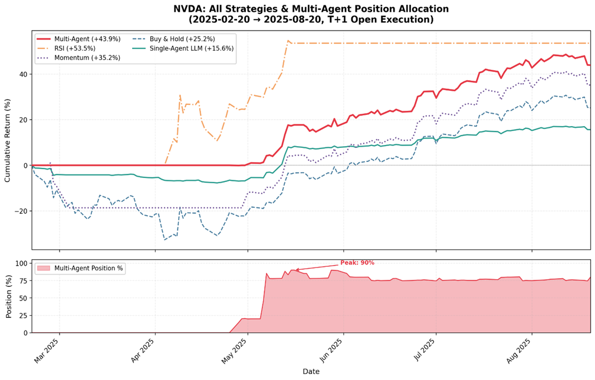
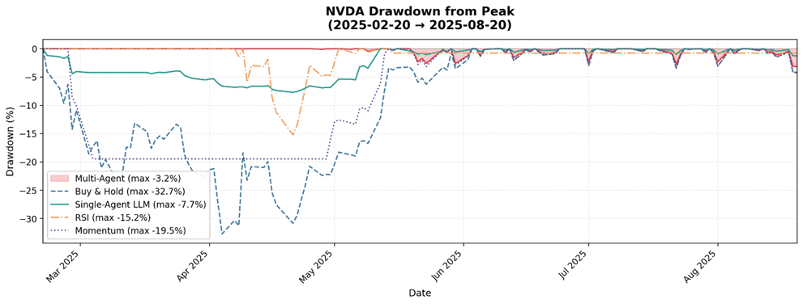
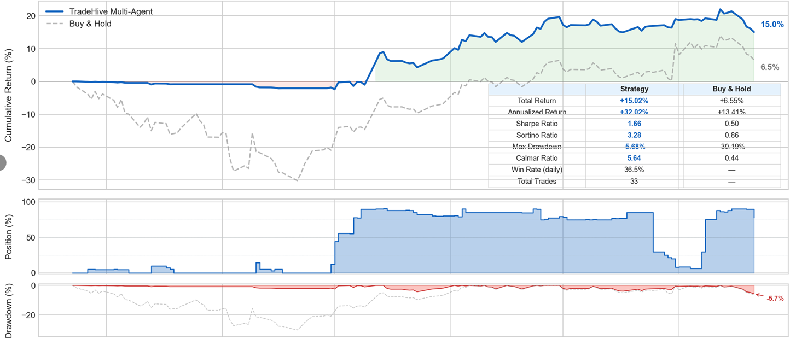
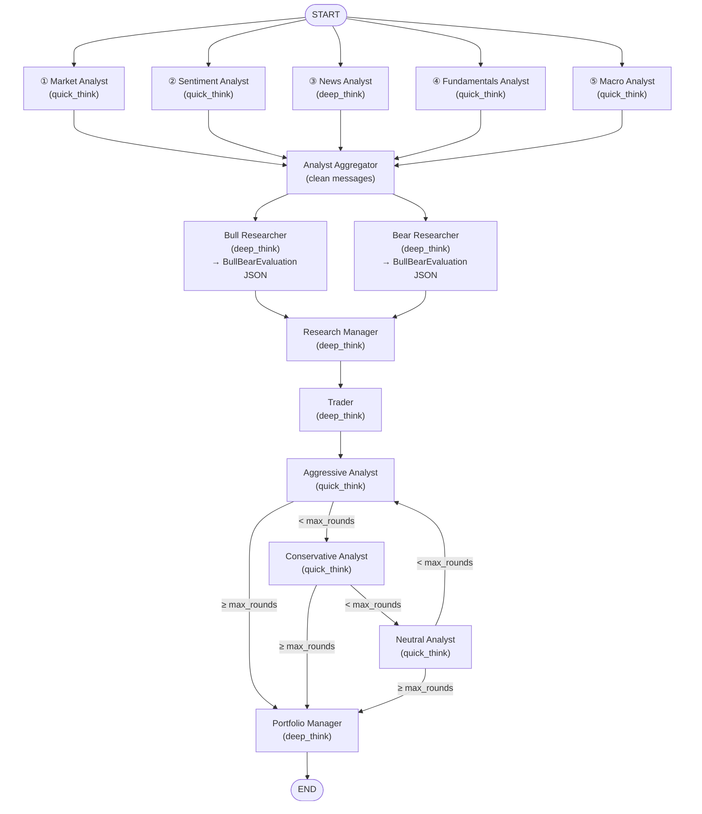

# TradeHive

**🌐 Language**: **简体中文** | [English](README_EN.md)


> 基于 [TauricResearch/TradingAgents](https://github.com/TauricResearch/TradingAgents) 二次开发的多智能体 LLM 金融交易决策框架。
> 通过 **硬纪律 + 软判断的混合架构**，把 LLM 的对抗性分析能力和代码层的风控兜底结合起来，实现可复现、低回撤的趋势交易决策。



---

## 目录

- [回测表现](#回测表现)
- [设计哲学](#设计哲学)
- [项目亮点](#项目亮点)
- [与原项目对比](#与原项目对比)
- [系统架构](#系统架构)
- [核心机制](#核心机制)
- [快速开始](#快速开始)
- [已知局限](#已知局限)
- [文档](#文档)
- [License](#license)
- [致谢与原项目](#致谢与原项目)

---

## 回测表现

### NVDA (2025-02-20 → 2025-08-20, 6 个月, T+1 开盘执行)

| 策略 | 累计收益 | 最大回撤 |
|------|---------|---------|
| **TradeHive Multi-Agent** | **+43.9%** | **-3.2%** |
| RSI 策略 | +53.5% | -15.2% |
| Momentum 策略 | +35.2% | -19.5% |
| Buy & Hold (NVDA) | +25.2% | -32.7% |
| Single-Agent LLM | +15.6% | -7.7% |

**核心观察**：在面对 NVDA 这种 2 月底 -30% 暴跌、5 月开始强反弹的剧烈行情中，TradeHive 把回撤压在 **-3.2%**（B&H 的 1/10），同时全程跑赢 B&H 18.7 个百分点。



#### 为什么没有超过 RSI / Momentum 这类传统策略？

NVDA 表上 TradeHive 的累计收益（+43.9%）介于 RSI（+53.5%）和 Momentum（+35.2%）之间。差距来自两点：

1. **仓位没有打满**：默认配置下 confirmed_uptrend 的仓位区间是 75–100%，回测期间峰值约 90%，并非全程满仓。把上限放宽或在主升段更激进，收益会显著提升（详见 [DEV_SPEC.md §5.9](DEV_SPEC.md#59-regime-仓位区间硬映射) 和 §6.1）
2. **设计上偏右侧入场**：状态机的硬门槛让 confirmed_uptrend 进入晚于绝对最低点——这是与 RSI/Momentum 这类瞬时信号策略的根本取舍

**但同等性能下，TradeHive 具备传统纯技术策略不具备的优势：**

- **风险控制是质的领先**：最大回撤 -3.2%，是 RSI 的 1/5、Momentum 的 1/6、B&H 的 1/10——稳定性远高于"高收益高波动"的指标策略
- **多维信号融合**：技术面只是 5 个分析师之一，还纳入了基本面、宏观、新闻、情绪。RSI/Momentum 是纯价量信号，在基本面恶化或重大事件冲击时会失效
- **决策可解释**：每一日的 reasoning、entry thesis、风险辩论记录完整可审计，方便事后归因；指标策略只能告诉你"信号触发了"
- **可泛化到新标的**：换 ticker（如 META 实测）不需要重新调参，传统策略往往需要按标的微调阈值
- **能处理非量化信息**：insider transactions、新闻事件、宏观转向等无法被 RSI/Momentum 编码的信息，会被融入 Bull/Bear 的对抗评估

### META（同期 6 个月）— 鲁棒性验证

| 指标 | TradeHive | Buy & Hold |
|------|-----------|-----------|
| 累计收益 | **+15.02%** | +6.55% |
| 年化收益 | +37.02% | +13.41% |
| Sharpe Ratio | 1.66 | 0.50 |
| Sortino Ratio | 3.28 | 0.86 |
| **最大回撤** | **-5.68%** | -30.19% |
| Calmar Ratio | 5.64 | 0.44 |
| 日胜率 | 36.5% | — |
| 总交易次数 | 33 | — |



> 说明：仓位偏好可在 Trader/PM 节点的 prompt 与代码层 `REGIME_POSITION_LIMITS` 中自由调整；以上结果使用默认的 confirmed_uptrend 75-100% 区间。

---

## 设计哲学

大模型在金融决策中最大的两个问题是：

1. **幻觉**——说出听起来合理但事实错误的论点
2. **指令遵循不精确**——要求 confirmed_downtrend 空仓，LLM 还是会想建仓 20%

原项目把所有决策都交给 LLM，结果是不可复现、风控失效、日频决策崩溃。**TradeHive 的核心设计是把有数学定义的约束硬编码，把需要综合判断的部分留给 LLM。**

| 层级 | 谁负责 | 内容 |
|------|--------|------|
| **硬纪律层** | 代码兜底 | 状态机合法转换、confirmed 进入/退出 6 选 5 / 5 选 4 阈值、regime → 仓位区间 clamp、字段顺序约束（驱动 KV cache 推理顺序） |
| **软判断层** | LLM | 4 维 evidence 提炼、反转信号识别、Bull/Bear 对抗评估、风险三方辩论、仓位微调 |

这种分工让 LLM 的不可靠部分被代码约束在可接受范围内，同时保留了 LLM 在多维信息综合上的能力——这是 TradeHive 与"全 LLM"和"全规则"两类系统的根本差异。

---

## 项目亮点

- **5 个分析师节点并行**（Market / Sentiment / News / Fundamentals / Macro），新增 Macro 节点从公司视角评估宏观影响
- **支持日频回测**：替换数据源、本地数据缓存（默认 5 年），决策可复现
- **7-regime 状态机** + 代码层硬兜底：confirmed state 难进难出，避免单日噪音误判
- **连续仓位管理**：从 Buy/Sell/Hold 三选一升级为 0–100% 目标仓位，支持加减仓、试探建仓
- **残差连接机制**：跨日传递 entry thesis + daily deltas，让 Research Manager 在历史推理基础上做增量判断
- **结构化输出 + 重试**：Bull/Bear/RM/Trader/PM 全部使用 Pydantic schema 校验 + ValidationError 反馈重试
- **Prompt 推理顺序工程**：通过 JSON schema 字段顺序约束 KV cache，使反转信号、扣分推理在分数之前生成
- **双层 regime clamp**：Trader 和 PM 各做一次 `REGIME_POSITION_LIMITS` 截断，确保 LLM 越界值被强制修正

---

## 与原项目对比

| 维度 | 原 TradingAgents | TradeHive |
|------|------------------|-----------|
| 决策粒度 | 仅输出 5 级 rating | 0–100% 连续目标仓位 |
| 仓位管理 | 完全靠 LLM 脑补 | regime 决定区间，代码 clamp 兜底 |
| 决策频率 | 仅支持低频（隔 5 天） | 支持日频 |
| 分析师执行 | 串行 4 个 | **并行 5 个**（新增 Macro） |
| 数据源 | 实时快照（无法回测） | 替换数据源 + 本地缓存（5 年） |
| 持仓上下文 | Agent 不知道当前持仓 | 完整持仓快照注入每日决策 |
| 跨日连贯性 | 仅传 `prev_regime` 标签 | **残差连接**：entry thesis + daily deltas |
| Confirmed 进入/退出 | 无门槛 | 6 选 5 / 5 选 4 硬阈值 |
| 输出格式 | 自由文本 | structured output + 重试 |
| NVDA 同期表现 | 最大回撤 -30%+（无法响应 2-14 起的连续下探）；多次回测累计收益波动巨大、不可复现 | 最大回撤 -3.2%，多次回测进入/退出节点稳定 |

详细对照见 [DEV_SPEC.md §6.3](DEV_SPEC.md#63-与-baseline-以及-single-agent-对比)。

---

## 系统架构



每个节点的详细职责见 [DEV_SPEC.md §2.1](DEV_SPEC.md#21-新流程图)。

---

## 核心机制

### 7-regime 状态机

```
confirmed_uptrend   → topping
early_uptrend       → confirmed_uptrend / consolidation
consolidation       → early_uptrend / early_downtrend
topping             → consolidation / early_downtrend / early_uptrend
early_downtrend     → confirmed_downtrend / consolidation
confirmed_downtrend → bottoming
bottoming           → consolidation / early_uptrend / early_downtrend
```

### Regime → 仓位区间硬映射

| Regime | 仓位区间 | 意图 |
|--------|---------|------|
| confirmed_uptrend | **75–100%** | 强势趋势，重仓 |
| early_uptrend | 30–60% | 趋势确认中，试探 |
| consolidation | 0–15% | 震荡期，观望为主 |
| topping | 20–40% | 顶部区域，减仓 |
| early_downtrend | 0–10% | 趋势恶化，撤退 |
| **confirmed_downtrend** | **0% 硬锁** | 完全空仓 |
| bottoming | 5–20% | 底部试探建仓 |

> Trader 和 PM 节点都会做一次 `REGIME_POSITION_LIMITS` clamp，确保 LLM 越界值被强制截断并重写 action 标签。

详细 confirmed 进入/退出阈值、残差连接机制等见 [DEV_SPEC.md §5](DEV_SPEC.md#5-回测引擎设计)；NVDA 整个回测期的**每日 Bull/Bear 打分 + regime 切换实录**（用于验证 6 选 5 / 5 选 4 硬阈值真实生效）见 [DEV_SPEC.md §6.2](DEV_SPEC.md#62-regime-识别效果每日打分)。

---

## 快速开始

### 环境要求

- Python ≥ 3.10
- 任一 LLM provider API Key：OpenAI / Anthropic / Google / xAI / OpenRouter
- 数据源 API Key：Alpha Vantage（[免费申请](https://www.alphavantage.co/support/#api-key)）

### 安装

```bash
git clone https://github.com/Handshakeworm/TradeHive-TradingAgents.git
cd TradeHive-TradingAgents

# 安装依赖（推荐使用虚拟环境）
pip install -e .

# 配置环境变量
cp .env.example .env
# 编辑 .env，填入对应 API Key
```

### LLM 配置

系统使用 **两档模型**：

- **`deep_think_llm`**：用于 News Analyst、Bull / Bear Researcher、Research Manager、Trader、Portfolio Manager 等需要长上下文 + 结构化推理的节点
- **`quick_think_llm`**：用于 Market / Sentiment / Fundamentals / Macro 4 个 Analyst、3 方 Risk Debate（Aggressive / Conservative / Neutral）、Reflector、Signal Processor 等节点

在 [main.py](main.py) 或 [tradingagents/default_config.py](tradingagents/default_config.py) 中配置：

```python
config["llm_provider"] = "openrouter"   # openai / anthropic / google / xai / openrouter
config["backend_url"]  = "https://openrouter.ai/api/v1"
config["deep_think_llm"]  = "deepseek/deepseek-v3.2"
config["quick_think_llm"] = "xiaomi/mimo-v2-flash"
```

> **README 中所有回测结果均使用以下配置**：
> `llm_provider=openrouter`，`deep_think_llm=deepseek/deepseek-v3.2`，`quick_think_llm=xiaomi/mimo-v2-flash`，`max_risk_discuss_rounds=1`。
> 更换 provider/模型后，结果可能与 README 数字存在差异。

### 运行回测

[main.py](main.py) 中已配置好默认的 NVDA 回测示例（2025-02-20 ~ 2025-08-20）：

```bash
python main.py
```

输出包含：交易日数、初始资金、最终资产、累计收益率。

### 单次决策模式

```python
from tradingagents.graph.trading_graph import TradingAgentsGraph
from tradingagents.default_config import DEFAULT_CONFIG

config = DEFAULT_CONFIG.copy()
ta = TradingAgentsGraph(
    selected_analysts=["market", "sentiment", "news", "fundamentals", "macro"],
    config=config,
)
_, decision = ta.propagate("NVDA", "2024-05-10")
print(decision)
```

> ⚠️ 默认所有情况下自带的 memory 功能都是**关闭的**。

---

## 已知局限

诚实地标注一下当前系统的边界，方便使用者评估是否适用于自己的场景：

- **成本与延迟**：每日决策需调用 5 个分析师 + Bull/Bear + RM + Trader + 3 个风控辩论员 + PM，单日 token 消耗较高，6 个月回测时间成本非可忽略
- **趋势导向，不适合短期反转股**：系统按"主升/主跌难进难出"设计，对于非长趋势、可能快速反转的标的，confirmed regime 的右侧识别会牺牲一些利润
- **偏右侧入场**：状态机的硬门槛设计让系统优先求稳，confirmed_uptrend 进入会迟于绝对最低点。如果想做到更敏锐识别，可微调阈值/prompt，但可能在别处把握不住利润
- **`regime_daily_deltas` 无长度截断**：当前实现下一个长 regime（如 60+ 天的 confirmed_uptrend）的 daily_deltas 累积可能达到数千字符，完整传入 RM prompt 会推高每日 token 成本
- **LLM 打分存在随机性**：完整或分段测试中进入/退出节点是稳定的，但单日打分存在随机波动。下游的代码硬阈值校验和 clamp 机制可缓解但不能消除这一点
- **暂未覆盖的场景**：crypto 与多标的 portfolio 仍在拓展中（见 [DEV_SPEC.md §7](DEV_SPEC.md#7-拓展方向)），鲁棒性测试需要更多市场环境验证

---

## 文档

- **[DEV_SPEC.md](DEV_SPEC.md)** — TradeHive 完整设计文档（节点改造、回测引擎、状态机、残差连接、回测评估等）
- **[DEV_SPEC_original.md](DEV_SPEC_original.md)** — 原 TradingAgents 项目的设计文档，了解 baseline 架构

---

## License

本项目以 **[Apache License 2.0](LICENSE)** 发布，与原项目 TauricResearch/TradingAgents 保持一致。允许商业使用、修改、分发，需保留版权与许可证声明。

---

## 致谢与原项目

本项目改编自 [TauricResearch/TradingAgents](https://github.com/TauricResearch/TradingAgents) — Multi-Agents LLM Financial Trading Framework。原项目作为 multi-agent 设计的优秀起点，激发了本项目的诸多改造方向，特此致谢。
