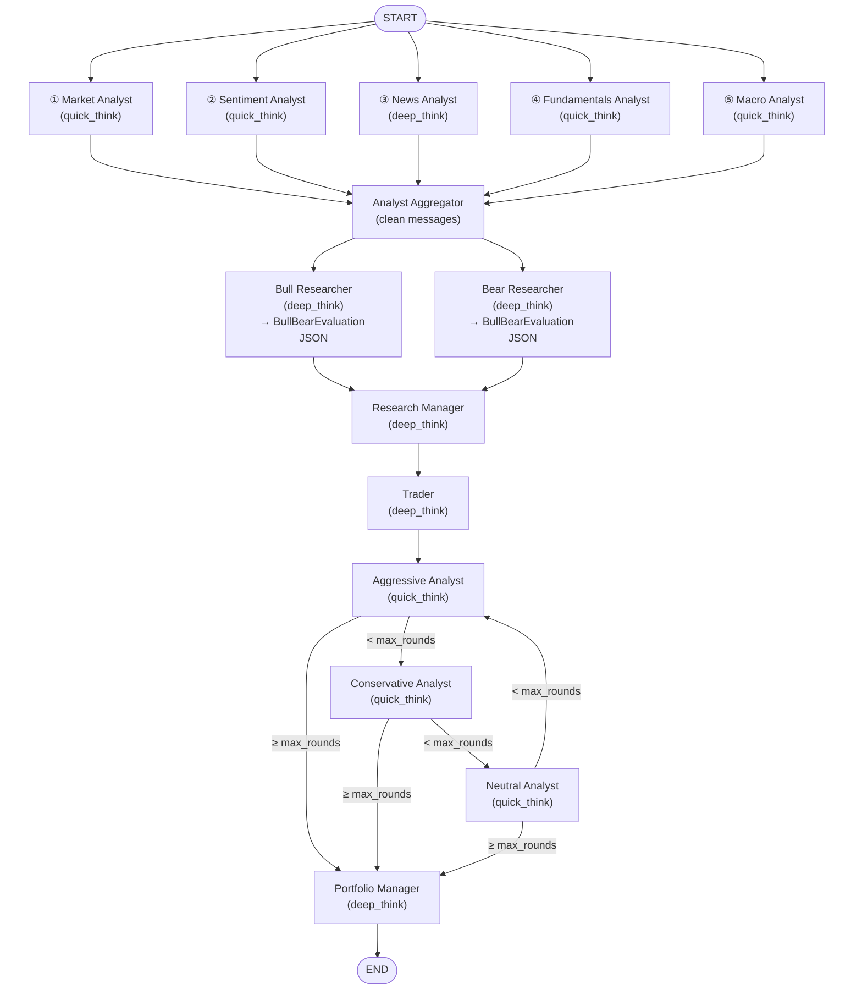

# TradeHive

**🌐 Language**: [简体中文](README.md) | **English**


> A multi-agent LLM framework for financial trading decisions, redesigned from [TauricResearch/TradingAgents](https://github.com/TauricResearch/TradingAgents).
> Through a **hard-discipline + soft-judgment hybrid architecture**, TradeHive combines the LLM's adversarial analysis capability with code-level risk guardrails, delivering reproducible, low-drawdown trend-following decisions.


---

## Table of Contents

- [Backtest Performance](#backtest-performance)
- [Design Philosophy](#design-philosophy)
- [Highlights](#highlights)
- [vs. Original Project](#vs-original-project)
- [System Architecture](#system-architecture)
- [Core Mechanisms](#core-mechanisms)
- [Quick Start](#quick-start)
- [Known Limitations](#known-limitations)
- [Documentation](#documentation)
- [License](#license)
- [Acknowledgements](#acknowledgements)

---

## Backtest Performance

### NVDA (2025-02-20 → 2025-08-20, 6 months, T+1 open execution)

| Strategy | Cumulative Return | Max Drawdown |
|----------|-------------------|--------------|
| **TradeHive Multi-Agent** | **+43.9%** | **-3.2%** |
| RSI strategy | +53.5% | -15.2% |
| Momentum strategy | +35.2% | -19.5% |
| Buy & Hold (NVDA) | +25.2% | -32.7% |
| Single-Agent LLM | +15.6% | -7.7% |

**Key observation**: In a volatile NVDA period (a -30% selloff in late February followed by a strong rally starting in May), TradeHive kept drawdown to **-3.2%** (one-tenth of Buy & Hold) while outperforming B&H by 18.7 percentage points over the full window.


#### Why didn't TradeHive beat RSI / Momentum?

On NVDA, TradeHive's cumulative return (+43.9%) sits between RSI (+53.5%) and Momentum (+35.2%). The gap comes from two design choices:

1. **Position not maxed out**: The default `confirmed_uptrend` allocation band is 75–100%, and the realized peak during the backtest was ~90% — not fully invested throughout. Raising the cap or being more aggressive in the main uptrend would lift returns meaningfully (see [DEV_SPEC_EN.md §5.9](DEV_SPEC_EN.md#59-regime--position-band-hard-mapping) and §6.1)
2. **Right-side entry by design**: The state machine's hard thresholds make `confirmed_uptrend` engage later than the absolute bottom — a deliberate trade-off versus the instant-signal nature of RSI/Momentum

**At comparable performance, TradeHive offers advantages that pure technical strategies cannot match:**

- **Risk control is a qualitative leap**: -3.2% max drawdown is roughly 1/5 of RSI's, 1/6 of Momentum's, and 1/10 of B&H's. Stability is far higher than indicator strategies' "high return, high volatility" profile
- **Multi-dimensional signal fusion**: Technicals are only one of five analysts; fundamentals, macro, news, and sentiment are all in the loop. RSI/Momentum are pure price/volume — they fail when fundamentals deteriorate or major news hits
- **Interpretable decisions**: Every day's reasoning, entry thesis, and risk-debate transcript are auditable, making post-hoc attribution easy. Indicator strategies can only tell you "the signal fired"
- **Generalizes to new tickers**: Switching tickers (e.g., META) requires no re-tuning, while traditional strategies usually need per-ticker threshold adjustment
- **Handles non-quantitative information**: Insider transactions, news catalysts, macro pivots — anything RSI/Momentum cannot encode is folded into Bull/Bear's adversarial evaluation

### META (same 6-month period) — robustness check

| Metric | TradeHive | Buy & Hold |
|--------|-----------|-----------|
| Cumulative Return | **+15.02%** | +6.55% |
| Annualized Return | +37.02% | +13.41% |
| Sharpe Ratio | 1.66 | 0.50 |
| Sortino Ratio | 3.28 | 0.86 |
| **Max Drawdown** | **-5.68%** | -30.19% |
| Calmar Ratio | 5.64 | 0.44 |
| Daily Win Rate | 36.5% | — |
| Total Trades | 33 | — |


> Note: Position preferences can be freely adjusted in the Trader/PM prompts and in the code-layer `REGIME_POSITION_LIMITS`. Results above use the default `confirmed_uptrend` band of 75–100%.

---

## Design Philosophy

The two biggest problems LLMs face in financial decision-making:

1. **Hallucinations** — producing plausible-sounding but factually wrong arguments
2. **Imprecise instruction following** — being told to stay flat in `confirmed_downtrend`, the LLM still wants to take a 20% position

The original project hands every decision to the LLM, leading to non-reproducible results, broken risk controls, and a collapse at the daily frequency. **TradeHive's core design is to hard-code constraints with mathematical definitions, and leave to the LLM what genuinely requires synthesis.**

| Layer | Owner | Responsibilities |
|-------|-------|------------------|
| **Hard-discipline layer** | Code guardrails | State-machine legal transitions; confirmed-entry/exit 6-of-5 / 5-of-4 thresholds; regime → position-band clamp; field-order constraints driving KV-cache reasoning order |
| **Soft-judgment layer** | LLM | 4-dimension evidence distillation; reversal-signal detection; Bull/Bear adversarial evaluation; 3-way risk debate; position fine-tuning |

This division keeps the LLM's unreliable parts bounded by code guardrails while preserving its strength in multi-dimensional information synthesis — the fundamental difference between TradeHive and either pure-LLM or pure-rule-based systems.

---

## Highlights

- **5 analyst nodes in parallel** (Market / Sentiment / News / Fundamentals / Macro), with a newly added Macro node that evaluates macro impact from a company-specific angle
- **Daily-frequency backtesting**: replaced data sources, local data cache (5 years by default), reproducible decisions
- **7-regime state machine** + code-level guardrails: confirmed states are hard to enter and hard to leave, immune to single-day noise
- **Continuous position management**: upgraded from a Buy/Sell/Hold trinary to a 0–100% target position, supporting scaling in, scaling out, and probe entries
- **Residual-connection mechanism**: entry thesis + daily deltas propagate across days, letting Research Manager make incremental judgments on top of prior reasoning
- **Structured output + retry**: Bull/Bear/RM/Trader/PM all use Pydantic-schema validation with ValidationError feedback retry
- **Prompt reasoning-order engineering**: JSON-schema field ordering constrains KV-cache so that reversal signals and deduction reasoning are generated *before* numerical scores
- **Double regime clamp**: Trader and PM each run a `REGIME_POSITION_LIMITS` clamp, forcing out-of-band LLM outputs back into the allowed range

---

## vs. Original Project

| Dimension | Original TradingAgents | TradeHive |
|-----------|------------------------|-----------|
| Decision granularity | 5-level rating only | Continuous 0–100% target position |
| Position management | Pure LLM guesswork | Regime determines band; code clamps |
| Decision frequency | Low-frequency only (every ~5 days) | Daily-frequency capable |
| Analyst execution | 4 sequential | **5 parallel** (Macro added) |
| Data source | Live snapshots (no backtest) | Replaced sources + local cache (5 yr) |
| Position context | Agent unaware of current holdings | Full position snapshot injected daily |
| Cross-day continuity | `prev_regime` label only | **Residual connection**: entry thesis + daily deltas |
| Confirmed entry/exit | No threshold | 6-of-5 / 5-of-4 hard thresholds |
| Output format | Free-form text | Structured output + retry |
| NVDA same-period result | -30%+ max DD (failed to respond to the 2025-02-14 selloff); cumulative return varies wildly across re-runs and is not reproducible | -3.2% max DD; entry/exit transitions stable across re-runs |

For the detailed comparison, see [DEV_SPEC_EN.md §6.3](DEV_SPEC_EN.md#63-vs-baseline-and-single-agent).

---

## System Architecture



Per-node responsibilities: [DEV_SPEC_EN.md §2.1](DEV_SPEC_EN.md#21-new-flowchart).

---

## Core Mechanisms

### 7-regime state machine

```
confirmed_uptrend   → topping
early_uptrend       → confirmed_uptrend / consolidation
consolidation       → early_uptrend / early_downtrend
topping             → consolidation / early_downtrend / early_uptrend
early_downtrend     → confirmed_downtrend / consolidation
confirmed_downtrend → bottoming
bottoming           → consolidation / early_uptrend / early_downtrend
```

### Regime → position band hard mapping

| Regime | Position Band | Intent |
|--------|--------------|--------|
| confirmed_uptrend | **75–100%** | Strong trend, full commitment |
| early_uptrend | 30–60% | Trend forming, probing |
| consolidation | 0–15% | Range-bound, mostly observing |
| topping | 20–40% | Top zone, scaling out |
| early_downtrend | 0–10% | Deterioration, retreating |
| **confirmed_downtrend** | **0% hard-locked** | Fully flat |
| bottoming | 5–20% | Bottom probing entry |

> Both Trader and PM nodes run a `REGIME_POSITION_LIMITS` clamp, forcing any out-of-band LLM output back into the allowed range and rewriting the action label.

For detailed confirmed-entry/exit thresholds and the residual-connection mechanism, see [DEV_SPEC_EN.md §5](DEV_SPEC_EN.md#5-backtest-engine-design). The full **per-day Bull/Bear scoring + regime transition log** across the entire NVDA backtest (showing the 6-of-5 / 5-of-4 hard thresholds firing in practice) is in [DEV_SPEC_EN.md §6.2](DEV_SPEC_EN.md#62-regime-identification-effectiveness).

---

## Quick Start

### Requirements

- Python ≥ 3.10
- One LLM provider API key: OpenAI / Anthropic / Google / xAI / OpenRouter
- Data source API key: Alpha Vantage ([free signup](https://www.alphavantage.co/support/#api-key))

### Installation

```bash
git clone https://github.com/Handshakeworm/TradeHive-TradingAgents.git
cd TradeHive-TradingAgents

# Install dependencies (a venv is recommended)
pip install -e .

# Set up environment
cp .env.example .env
# Edit .env and fill in the relevant API keys
```

### LLM configuration

The system uses **two model tiers**:

- **`deep_think_llm`** — drives nodes that need long-context + structured reasoning: News Analyst, Bull / Bear Researcher, Research Manager, Trader, Portfolio Manager
- **`quick_think_llm`** — drives the 4 tool-heavy Analysts (Market / Sentiment / Fundamentals / Macro), the 3 Risk Debaters (Aggressive / Conservative / Neutral), Reflector, Signal Processor

Configure in [main.py](main.py) or [tradingagents/default_config.py](tradingagents/default_config.py):

```python
config["llm_provider"] = "openrouter"   # openai / anthropic / google / xai / openrouter
config["backend_url"]  = "https://openrouter.ai/api/v1"
config["deep_think_llm"]  = "deepseek/deepseek-v3.2"
config["quick_think_llm"] = "xiaomi/mimo-v2-flash"
```

> **All backtest results in this README use the following setup**:
> `llm_provider=openrouter`, `deep_think_llm=deepseek/deepseek-v3.2`, `quick_think_llm=xiaomi/mimo-v2-flash`, `max_risk_discuss_rounds=1`.
> Switching providers/models may produce results that differ from the numbers above.

### Run a backtest

[main.py](main.py) ships with a default NVDA backtest example (2025-02-20 → 2025-08-20):

```bash
python main.py
```

Output includes: trading days, initial capital, final value, cumulative return.

### Single-day decision mode

```python
from tradingagents.graph.trading_graph import TradingAgentsGraph
from tradingagents.default_config import DEFAULT_CONFIG

config = DEFAULT_CONFIG.copy()
ta = TradingAgentsGraph(
    selected_analysts=["market", "sentiment", "news", "fundamentals", "macro"],
    config=config,
)
_, decision = ta.propagate("NVDA", "2024-05-10")
print(decision)
```

> ⚠️ The built-in memory feature is **disabled in all configurations** by default.

---

## Known Limitations

An honest accounting of the system's current boundaries:

- **Cost and latency**: Each daily decision invokes 5 analysts + Bull/Bear + RM + Trader + 3 risk debaters + PM. Daily token consumption is non-trivial, and a 6-month backtest takes meaningful wall-clock time
- **Trend-oriented, not built for short-reversal tickers**: The system is designed around "hard to enter, hard to leave" confirmed regimes. For tickers without long trends — or those that reverse quickly — the right-side identification of confirmed states sacrifices some upside
- **Right-side entry**: The hard-threshold state machine deliberately prioritizes stability, so `confirmed_uptrend` engages later than the absolute bottom. Loosening thresholds/prompts would improve responsiveness but may sacrifice profits elsewhere
- **`regime_daily_deltas` is not length-capped**: In the current implementation a long regime (e.g., 60+ days of `confirmed_uptrend`) can accumulate several thousand characters in `daily_deltas`, all of which are fed into the RM prompt — pushing up daily token cost
- **LLM scoring has randomness**: Across full or sectional re-runs, entry and exit points have proven stable, but per-day scores fluctuate. Code-level threshold checks and clamps mitigate this but cannot eliminate it
- **Coverage gaps**: Crypto and multi-asset portfolio support are still in development (see [DEV_SPEC_EN.md §7](DEV_SPEC_EN.md#7-roadmap)); robustness still needs validation across more market environments

---

## Documentation

- **[DEV_SPEC_EN.md](DEV_SPEC_EN.md)** — Complete TradeHive design document (node redesigns, backtest engine, state machine, residual connections, backtest evaluation, etc.)
- **[DEV_SPEC_original.md](DEV_SPEC_original.md)** — Original TradingAgents design document (baseline architecture, currently Chinese only)

---

## License

This project is released under the **[Apache License 2.0](LICENSE)**, matching the upstream TauricResearch/TradingAgents. Commercial use, modification, and distribution are permitted; the copyright notice and license must be retained.

---

## Acknowledgements

TradeHive is adapted from [TauricResearch/TradingAgents](https://github.com/TauricResearch/TradingAgents) — Multi-Agents LLM Financial Trading Framework. The original project provided an excellent multi-agent foundation that inspired many of the redesigns in this fork; we gratefully acknowledge their work.
