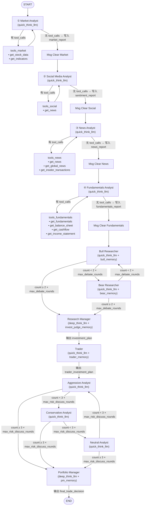
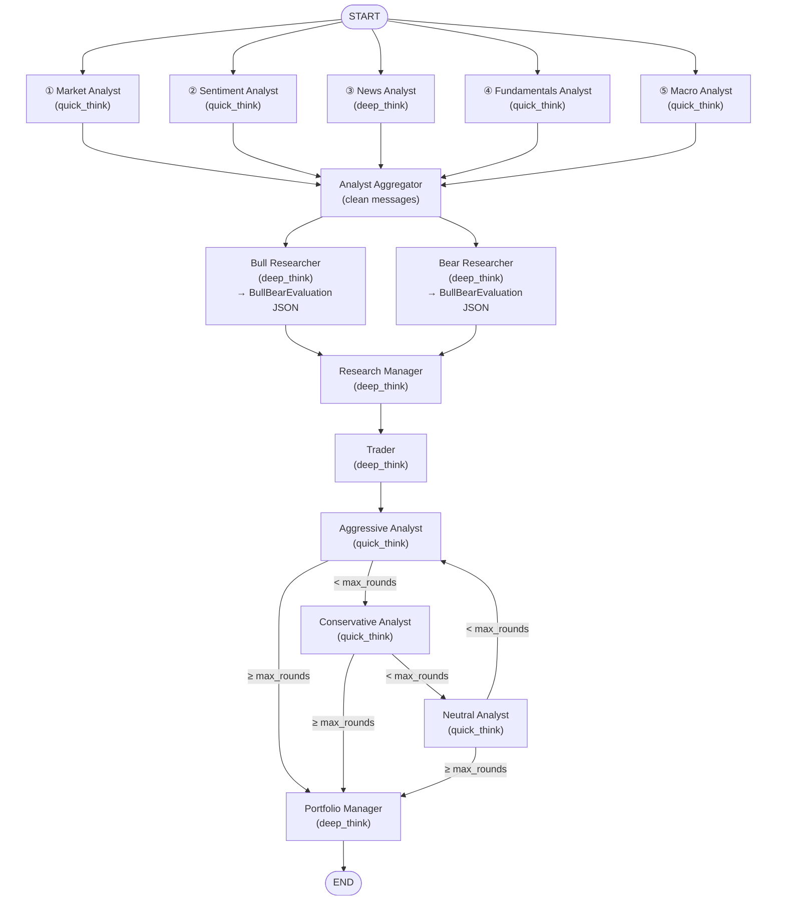

# 注意：所有情况下，自带的记忆功能都是关闭的。
# 原开源项目baseline：
## 介绍
原项目数据不支持回测，很多tools返回实时快照，我们在保留了原先一样功能的基础上进行了替换数据源

支持多年数据，我们取了5年，做了本地数据缓存

处理baseline，我们尽量让其保持原样，并修改至让其可用

此为原项目流程



| 阶段 | 节点 | 模型 | 读取的数据 | 实际职能 |
|------|------|------|-----------|---------|
| 投资辩论 | Bull / Bear Researcher | quick | 四份报告（技术面、情绪面、新闻、基本面）+ 历史记忆 + 辩论历史。首轮读取报告，后续轮次仅依赖辩论历史和记忆 | 辩论标的是否值得投资 |
| 投资裁决 | Research Manager | deep | 完整辩论历史 + 四份报告（用于检索记忆）+ 历史记忆 | 总结辩论、做出 Buy/Sell/Hold 决策、制定投资计划 |
| 交易转化 | Trader | quick | Research Manager 的投资计划 + 四份报告 + 历史记忆 | 将投资计划转化为明确的交易信号（BUY/HOLD/SELL） |
| 风险辩论 | Aggressive / Conservative / Neutral | quick | Trader 的交易计划 + 辩论历史。首轮读取四份报告，后续轮次仅依赖辩论历史 | 评估 Trader 决策的风险合理性，辩论策略应偏激进还是保守 |
| 最终决策 | Portfolio Manager | deep | 风险辩论完整历史 + Research Manager 的投资计划 + 四份报告（用于检索记忆）+ 历史记忆 | 综合风险辩论，给出五级评级 |


可以看到这个项目只能给rating，仓位管理等等其他只靠大模型脑部。

日频级别决策效果极差，只能隔5天一决策，我们改进完的multiagent系统支持日频决策的


# 新multi agent（在baseline的基础上进行修改，但基本上来说，我们重构了整个系统）：

此为新的流程图




原先系统存在功能缺失，分工不明不合理的问题

现在所有节点的system prompt都从你是helpful ai assistant，变成了对应职位

功能边界收紧，明确指示禁止提到任何交易决策信息

## analyst修改：
每个prompt都进行了优化，给出了明确工作流，调用工具返回信息的使用指导

### 1. market analyst节点

增加：更多indicator，筹码结构，涨跌幅，周线数据

规定了拉取数据最小窗口需要6个月

### 2. sentiment节点
由原先的social media analyst节点改进而来，原先只传入新闻信息，名不副实

按日为单位，聚合alpha vantage的新闻情绪分数，给出大模型选定区间的打分

新增vix数据

### 3. 新增macro节点
分析：从股票/公司视角评估宏观环境对本ticker的具体影响（而非泛论宏观），覆盖6个维度：
1. 货币政策：Fed Funds Rate + 10Y Treasury → 估值倍数、债务成本、资本配置
2. 通胀：CPI → Fed政策路径、企业成本结构、定价权
3. 增长：Real GDP → 营收前景、终端需求
4. 就业：Unemployment → 消费端对ticker客户群的购买力影响
5. 风险偏好：VIX → 市场恐慌/贪婪对ticker交易环境的影响
6. 汇率：DXY → 海外营收换算、进口成本

输出约束：每个指标强制映射到本ticker、给出整体判决（Tailwind / Neutral / Headwind）+ 2-3句理由、必有汇总表


### 4. fundamental节点

现要求有具体的分析维度

(a) Profitability（盈利能力）：margins、ROE、盈利增长轨迹

(b) Financial health（财务健康）：debt-to-equity、current ratio、现金储备

(c) Growth（成长性）：营收和盈利增长率、多年 YoY 趋势

(d) Valuation（估值）：P/E / P/B / P/S，相对历史区间和成长性判断便宜还是贵

(e) Cash flow quality（现金流质量）：FCF 生成能力、capex 强度、分红/回购可持续性

精确要求返回分析指标，如 P/E, P/B, P/S, ROE, margins, EPS


### 5. news节点
要求报告必须同时覆盖 company developments / sector trends / macro context / insider activity


## 后续节点修改

### 结构化输出保证

**两层保障**

**第一层：`with_structured_output()` — 约束 + 校验一体化**

- 传入 Pydantic schema，底层自动用 tool calling / JSON mode 约束模型输出，同时校验字段类型、取值范围、业务语义

**第二层：兜底重试**

- 三个结构化节点（Research Manager、Trader、Portfolio Manager）均需
- **校验失败**：将 ValidationError feedback 回模型重新生成
- **调用失败**（网络超时、rate limit、5xx）：指数退避重试

### 1. bull/bear researcher的辩论职责，原先是 辩论是否值得建仓

现改为Bull 和 Bear **并行**精炼 5 份报告（独立评估，互不影响分数），使用 deep thinking 模型，structured output：

**Bull/Bear 输入：**
- 5 份分析师报告：Market（技术面+筹码）、Sentiment（情绪）、News（新闻）、Fundamentals（基本面）、Macro（宏观）
- prev_regime：当前 regime 状态
- **完整的 7 regime 状态机图**（每个 regime 的合法下一步 transition 作为 prompt 的一部分注入）
- 过往记忆：类似情境下的决策教训

**Bull/Bear 工作流程（prompt 引导）：**
1. 通读 5 份报告，将所有信息归类到 4 个维度（基本面、技术面、宏观、情绪）
   - 每条信息归入最相关的一个维度
2. 在当前 regime 语境下筛选证据：
   - Bull 关注支持沿状态机向上路径的证据（升级或维持 bullish 状态）
   - Bear 关注支持沿状态机向下路径的证据（降级或维持 bearish 状态）
3. 每个维度列出最多 5 条关键证据，按重要性排序
4. **反转信号检查**：所有证据呈列完毕后，专门检查以下 **4 种**合法反转信号是否出现（trending regime 下默认为 0，需强证据才能 override；实际上限即 4 条，每种类型最多一条）：
   - **量价背离** — 价格创新高但成交量递减（顶部），或价格创新低但成交量萎缩、抛压枯竭（底部）
   - **极端情绪** — 新闻情绪评分呈现一致看多/看空的极端单边状态（物极必反信号）
   - **价格对消息钝化** — 明确的利空催化剂不跌（底部信号）或利好催化剂不涨（顶部信号）
   - **决定性反转日** — 单日 ≥8% 反向移动 + 成交量 ≥1.5× 20 日均量 + 至少一项确认信号（回收短中期均线 / RSI 从超卖或超买区回归中性 / 板块共振反转）。专门捕捉 V 型反转这类前三种信号无法覆盖的决定性日子
   - Bull 检查见顶信号，Bear 检查见底信号——各自"自我质疑"
   - **严格约束**：prompt 明确禁止将 RSI、MACD、insider selling、估值、筹码结构、期权持仓等单独列为反转信号——它们应该进入 dimension evidence 和 score，不属于 reversal_signals
   - **多日持续性**：反转信号原则上需要至少 2 个连续交易日的证据支持（防止单日噪声），但"决定性反转日"是明确的例外
5. **所有证据和反转信号呈列完毕后**，再逐维度打分（1-10）。因字段顺序约束，KV cache 中已有反转信号，打分会自然考虑
6. **先算总分，再逐项扣分** 计算 overall_conviction（**强制公式**，非自由判断）：
   - **Step 1**：`base = round(avg(4 个维度分))` — 4 个维度分的平均值（四舍五入取整），即"总分"
   - **Step 2**：对每个识别到的 reversal signal 在 base 上**显式向下扣分**，每项单独说明（通常每个信号 -1）
   - **Step 3**：整段计算过程必须写入 `conviction_reasoning` 字段（范例：`Avg(7+9+6+8)/4=7.5→8. -1 extreme sentiment, -1 volume divergence → 6`）
   - 最终 `overall_conviction` 数字必须和 `conviction_reasoning` 里的计算结果一致
   - 顺序关键：**必须先算 4 维平均得到总分，再在总分上扣 reversal 分**（而不是把 reversal 直接并入维度分稀释）
7. 最后输出 time_horizon 和 core_thesis

**Bull/Bear 输出（structured output，复用现有 `invoke_structured` + 重试机制）：**

字段按以下顺序排列（顺序关键：structured output 按字段顺序生成，前面字段的内容进入 KV cache 后影响后续字段的生成质量）：

| 顺序 | 字段 | Bull 含义 | Bear 含义 |
|------|------|----------|----------|
| 1 | fundamentals_evidence | 基本面利好依据（最多 5 条，按重要性排序） | 基本面利空依据 |
| 2 | technicals_evidence | 技术面利好依据（最多 5 条） | 技术面利空依据 |
| 3 | macro_evidence | 宏观利好依据（最多 5 条） | 宏观利空依据 |
| 4 | sentiment_evidence | 情绪利好依据（最多 5 条） | 情绪利空依据 |
| 5 | **reversal_signals** | **见顶信号（list[str]，0-4 条）** | **见底信号（list[str]，0-4 条）** |
| 6 | fundamentals_score (1-10) | 基本面利好程度 | 基本面利空程度 |
| 7 | technicals_score (1-10) | 技术面利好程度 | 技术面利空程度 |
| 8 | macro_score (1-10) | 宏观利好程度 | 宏观利空程度 |
| 9 | sentiment_score (1-10) | 情绪利好程度 | 情绪利空程度 |
| 10 | **conviction_reasoning** | **完整算式文本（先于 conviction 数字生成，强制 LLM 写出平均值 + 扣分明细）** | **完整算式文本（先于 conviction 数字生成，强制 LLM 写出平均值 + 扣分明细）** |
| 11 | overall_conviction (1-10) | 总体看多/看空信心（必须与 conviction_reasoning 的计算结果一致） | 总体看多/看空信心（必须与 conviction_reasoning 的计算结果一致） |
| 12 | time_horizon | "看好 X 周/月" | "风险持续 X 周/月" |
| 13 | core_thesis | 最核心的一个论点 | 最核心的一个论点 |

**设计要点：**
- **字段顺序即推理顺序**：evidence → reversal_signals → dimension scores → conviction_reasoning → overall_conviction。模型生成 score 时 KV cache 中已有反转信号，自然纳入考量；生成 conviction_reasoning 时已有全部维度分和反转信号；生成 overall_conviction 数字时 KV cache 中已有完整算式文本，数字必须匹配文本里的计算结果。如果 reversal_signals 排在 conviction 之后，反转信号就无法影响打分，形同虚设
- 分数越大，对 Bull 来说越利好 / 对 Bear 来说越利空
- 传入 prev_regime，Bull/Bear 在当前 regime 语境下打分（uptrend 下正常回调不应大幅降低技术面分数；downtrend 下单日反弹不应大幅降低 bear 分数——区分"死猫跳"和真正的趋势反转）
- **强制算式透明化**：overall_conviction = round(avg(4 维分)) − Σ(reversal 扣分)，先算总分再逐项扣分。计算过程必须写入 conviction_reasoning 字段，便于事后审计和 debug。通过字段顺序约束（reasoning 必须在数字之前生成）确保数字来自推理而不是直觉
- **反转信号后处理**：`filter_reversal_signals()` 会自动过滤掉含否定表述的条目（正则匹配 `not found` / `not present` / `no signal` / `not detected` / `not applicable` / `does not apply` / `not met`，大小写不敏感），防止 LLM 列出"占位式"伪信号（例如 "price desensitization: NOT FOUND"）污染 reversal_signals 计数；被过滤的条目会记 warning 日志便于事后审计


### 2. research manager的职责原先为：总结辩论、做出 Buy/Sell/Hold 决策、制定投资计划
现改为：**职责极度收窄，只判断当前 regime，不做任何交易建议**（prompt 开头明文：`Your ONLY task is to determine the current market regime. You do NOT decide Buy/Sell/Hold — that is the Trader's job.`）

**RM 输入（6 项）：**
- Bull 结构化评估（JSON：4 维 evidence + 4 维 scores + reversal_signals + conviction + core_thesis + time_horizon）
- Bear 结构化评估（同上）
- **prev_regime**：昨日 regime，作为状态连续性的起点
- **entry_thesis**（残差连接）：RM 自己在当前 regime 首次生效那天写的核心论据。只要 regime 不变，每天原样回传给 RM 自己
- **daily_deltas**（残差连接）：RM 自己每天写的"今日相对昨日的增量变化"累积列表。regime 切换时会压缩旧 regime 的摘要作为 `[Transition from ...]` 标记
- **过往记忆**：用 `bull.core_thesis + bear.core_thesis` 作为 memory key 召回 2 条相似情境下的历史反思（比原版用 5 份报告原文做 key 更精炼、更有意义）

**RM 工作流程（prompt 强制）：**
1. **默认维持**：`Your default output is: {prev_regime} (no change)`——必须有具体、可复核的证据才能切换 regime
2. **Bull/Bear 逐维度对比**：Bull fundamentals 8 vs Bear fundamentals 3 → 基本面强支撑；两侧相近 → 该维度高置信度；两侧分歧 → 用 evidence 质量和 reversal signals 打破平局
3. **反转信号解读**：
   - Bull reports 2+ topping signals → 即使打分好看也可能降级
   - Bear reports 2+ bottoming signals → 即使打分难看也可能升级
   - 核心原则："**该强的一边自己松了，最具权威**"（When the side that SHOULD be strongest admits weakness, that is high-conviction evidence）
4. **合法转移约束**：`LEGAL_TRANSITIONS[prev_regime]` 作为 prompt 的一部分注入，RM 只能从这个集合里选择下一日 regime
5. **Confirmed state 硬门槛**（prompt 明文列出，RM 必须自行核对）：
   - 进入 `confirmed_uptrend`：Bull conviction ≥ 8、Bull tech ≥ 8、Bull fund ≥ 7、Bull reversal_signals = 0、Bear conviction ≤ 6、Bear tech ≤ 6，**6 选 5**
   - 进入 `confirmed_downtrend`：对称的 Bear 侧阈值，**6 选 5**
   - 退出 `confirmed_uptrend`：Bull conviction ≤ 7、Bull reversal_signals ≥ 2、Bull tech ≤ 7、Bear conviction ≥ 8、Bear tech ≥ 8，**5 选 4**
   - 退出 `confirmed_downtrend`：对称的 5 选 4
   - 明确规定："Normal pullbacks, single bad news events, or short-term technical weakness are NOT sufficient to exit confirmed states"
6. **Thesis continuity 原则**：切换 regime 之前必须显式评估"原 entry_thesis 是否还成立"。thesis 被推翻的标志是"thesis 依赖的关键假设被新证据矛盾"（例：thesis 里提到的支撑位被击穿、预期催化剂未兑现、支撑 thesis 的维度分数反转）。只有这种明确的 invalidation 才触发 regime 切换，避免"情绪性"跳转

**RM 输出（structured output，3 个字段）：**

| 字段 | 说明 |
|------|------|
| `market_regime` | 7 种之一：confirmed_uptrend / early_uptrend / consolidation / topping / early_downtrend / confirmed_downtrend / bottoming |
| `entry_thesis` | 本 regime 的核心论据。regime 不变 → 原样复述上一日的 entry_thesis；regime 变 → 写新 thesis。**下一日会作为 "Entry thesis" 输入回传给 RM 自己** |
| `daily_delta` | 一句话："今日较昨日有什么新变化"（新证据出现、thesis 得到确认、thesis 被削弱等）。**追加到 daily_deltas 列表，下一日原样回传** |

**代码层兜底（`_validate_regime_transition`，不依赖 LLM 合规）：**

Research Manager 只是 prompt 层约束，代码层还有**硬编码的规则兜底**，确保即使 LLM 违反 prompt 也能被修正：

1. **非法 transition 检测**：LLM 输出的 regime 不在 `LEGAL_TRANSITIONS[prev]` 里 → 按 `_REGIME_RANK`（0=confirmed_downtrend ... 6=confirmed_uptrend）找"意图方向最接近的合法 regime"兜底
2. **Confirmed 进入门槛校验**：LLM 选了 `confirmed_*` 但 6 选 5 不满足 → 强制回退到 prev_regime
3. **Auto-upgrade**：LLM 没选 confirmed，但硬阈值已满足且合法 → 代码强制升级到 confirmed（避免 LLM 保守错过）
4. **Confirmed 退出门槛校验**：LLM 想离开 confirmed 但 5 选 4 不满足 → 强制留在 confirmed
5. **Auto-downgrade**：LLM 留在 confirmed 但退出门槛已满足 → 强制退出到 `topping`（confirmed_uptrend）/`bottoming`（confirmed_downtrend）
6. **override 审计**：任何修正都会记 `logger.info` 并把 `[Code override: X → Y]` 标注追加到 entry_thesis，便于事后排查"为什么 RM 和实际 regime 不一致"

**设计要点：**
- **职责单一化**：RM 只判断 regime，不做动作决策，由下游 Trader 和 PM 分别处理。避免一个节点同时管判断 + 动作导致决策空间膨胀
- **不看原始报告**：RM 只看 Bull/Bear 的结构化 JSON，不看 5 份 analyst 原始报告——因为 Bull/Bear 已经把报告精炼过了，RM 再读一遍就是浪费 context window 和引入不一致
- **残差连接**：entry_thesis + daily_deltas 的自回环让 RM 每天能看到"自己昨天的思考"，强制多日判断一致性，避免"今天 uptrend 明天 downtrend"的震荡
- **双层约束**：prompt 层（LLM 自觉遵守）+ 代码层（硬兜底）双保险。LLM 保守时代码强制升级，LLM 激进时代码强制回退。最终 regime 永远满足状态机和硬门槛约束
- **regime → 仓位映射由 Trader 完成**：RM 只输出 regime 标签，具体每个 regime 对应的仓位区间（如 confirmed_uptrend → 75-100%）由 Trader 节点的 prompt 承担


### 残差连接/状态机会在回测分析中详细介绍


### 3. trader职责修改

**原版职责**：读 4 份原始报告 + RM 的自由格式 `investment_plan`，输出一段自由文本，以 `FINAL TRANSACTION PROPOSAL: **BUY/HOLD/SELL**` 结尾。**只有三选一的离散动作，没有仓位概念，没有 regime 约束，没有持仓上下文**。

**现版职责**：**Execution Planner**——把 Research Manager 识别的 regime 翻译成具体的量化交易计划。prompt 开头明文：`You are the Execution Planner (Trader). The Research Manager has identified the market regime. Your job is to decide the trading direction AND translate it into a concrete, quantitative trading plan.`

**Trader 输入（5 项）：**
- **Research Manager 决策**：`market_regime` + `entry_thesis`（regime 的核心论据）
- **Bull/Bear 结构化评估摘要**（`_format_bull_bear_summary`）：4 维分数对比、每维前 2 条 evidence、overall_conviction、core_thesis、time_horizon、reversal_signals 完整列表
- **当前持仓状态**：`current_position_pct`（当前仓位 %）、`avg_cost`（平均成本）、`total_capital`（总资金）、`unrealized_pnl_pct`（未实现盈亏 %）、`last_action`（上一次动作）
- **当前价格**：`current_price`

**Trader 决策流程（prompt 引导）：**

1. **决定方向（action）**：
   - Bull conviction 显著 > Bear → 倾向 Buy
   - Bear conviction 显著 > Bull → 倾向 Sell
   - 平衡或 regime 是 consolidation → 倾向 Hold

2. **决定目标仓位（target_position_pct）**：
   - **regime 决定仓位区间**（硬映射，见下表）
   - 在区间内用 Bull/Bear conviction **微调**：Bull 越高 → 取区间上限；reversal signal 越多 → 取区间下限

3. **action 标签必须和 target_position_pct 一致**（相对化定义，而不是绝对方向）：
   - **Buy** = `target_position_pct` > 当前仓位
   - **Sell** = `target_position_pct` < 当前仓位
   - **Hold** = `target_position_pct` 与当前仓位相差 ±3% 以内
   - 例如当前仓位 80%，target 60% → 即使 regime 是 uptrend，action 也是 **Sell**（因为在减仓）

**Regime → 仓位区间硬映射**（prompt 里明文告知 LLM，代码层也强制执行）：

| Regime | 仓位区间 | 意图 |
|--------|---------|------|
| confirmed_uptrend | **75-100%** | 强势趋势，重仓 |
| early_uptrend | 30-60% | 趋势确认中，试探 |
| consolidation | 0-15% | 震荡期，观望为主 |
| topping | 20-40% | 顶部区域，减仓 |
| early_downtrend | 0-10% | 趋势恶化，撤退 |
| **confirmed_downtrend** | **0% 硬锁** | 完全空仓 |
| bottoming | 5-20% | 底部试探建仓 |

**执行时间语义**：prompt 明确告知 LLM：`Trades are executed at next trading day's market open at market price`。今日决策，次日开盘执行。LLM 必须意识到"今天的价格不是成交价"，不能被当日微小波动干扰。

**Trader 输出（structured output，3 字段）：**

| 字段 | 类型 | 说明 |
|------|------|------|
| `action` | Literal["Buy", "Sell", "Hold"] | 三选一，必须与 target_position_pct 相对当前仓位的方向一致 |
| `target_position_pct` | float 0-100 | 执行后的目标总仓位百分比 |
| `reasoning` | str | 决策依据，要求 "ground your reasoning in specific evidence from the Bull/Bear evaluations above" |

**代码层兜底（`REGIME_POSITION_LIMITS` clamp，不依赖 LLM 合规）：**

LLM 输出之后，代码强制做一次 **仓位截断**：

1. `raw_pct = decision.target_position_pct`（LLM 原始输出）
2. `clamped_pct = max(pos_min, min(pos_max, raw_pct))`（按当前 regime 的区间硬限幅）
3. **如果 clamp 生效（LLM 越界）**：
   - **重新计算 action 标签**：根据 `clamped_pct` 和 `current_position_pct` 的关系重新决定 Buy/Sell/Hold，确保 action 和 target 一致
   - **在 reasoning 末尾追加 `[Clamped from X% to Y% by regime limit]`** 供事后审计
   - 记 `logger.warning` 日志
4. 典型场景：LLM 在 confirmed_downtrend 下想建仓 30%，代码强制 clamp 到 **0%**，action 从 "Buy" 改写成符合 0% 目标的值

这条兜底**保证最终执行的仓位一定在 regime 允许的区间内**，不依赖 LLM 对 prompt 的遵守。

**核心创新点（相对原版）：**

1. **从"二元决策"升级到"连续仓位管理"**：原版只有 Buy/Sell/Hold 三选一没有数量，现版输出 0-100% 的连续 `target_position_pct`，支持部分仓位、加仓、减仓、试探性建仓等精细操作
2. **action 相对化**：action 不再表达"对股票的绝对方向判断"，而是表达"相对当前仓位的动作"（80% → 60% 即使在 uptrend 也是 Sell），更契合实际交易语义
3. **regime → 仓位硬映射**：每个 regime 对应一个仓位区间，既在 prompt 里告知 LLM，又在代码层强制执行。确保仓位纪律（confirmed_downtrend 永远空仓、confirmed_uptrend 永远重仓）
4. **持仓状态感知**：读取当前仓位、成本、盈亏、上一动作，让 LLM 基于"我现在是什么状态"做决策，而不是每天从零判断方向
5. **次日开盘执行的时间语义**：prompt 明确告知 LLM 决策的执行时间滞后一天，避免 LLM 被当日微小波动误导
6. **代码层 clamp 兜底**：即使 LLM 违反 regime 仓位区间，代码也会强制截断并重写 action 标签。prompt 层（LLM 自觉）+ 代码层（硬兜底）双保险


### 4. aggressive/neutral/conservative debater的职责为：

**原版职责**：围绕一个抽象的"投资 proposal"做意见攻防，输出自由文本，没有具体量化参数作为靶子。

**现版职责**：**对 Trader 的具体量化交易计划进行风险侧的三方辩论**——不是抽象讨论"该不该买"，而是具体讨论"Trader 给出的 `target_position_pct` 是不是太激进 / 太保守 / 刚刚好"。三个 debator 并行辩论多轮，最后由 PM 综合拍板。

**所有 3 个 debator 共享的输入：**
- **Trader 的量化计划**：`action` + `target_position_pct`（这是辩论的**靶子**）
- **Research Manager 的 regime 判断**：`market_regime`（决定仓位区间的硬约束）
- **Bull/Bear 结构化评估摘要**：4 维分数对比 + conviction + reversal_signals（只在 count=0 首轮注入，后续轮次省略以节省 context）
- **当前持仓状态**：`current_position_pct` + `avg_cost` + `unrealized_pnl_pct`（当前浮亏浮盈） + `current_price`
- **风险辩论历史**：`history` + 各自的历史累积 + 对手的上一轮回应
- **count**：当前是第几轮辩论

**3 个 debator 统一的评估维度**（prompt 里每个都必须回答）：
1. Trader 的仓位是否匹配当前 regime？
2. 从当前仓位 `position_pct` 切换到 `target_position_pct` 的幅度是否合理？
3. 如果持有大仓位，上涨趋势是否还完整——是否在忽略反转信号？

**3 个 debator 的立场分工：**

#### Aggressive Debator（激进派）
- **立场**：为 MAXIMIZING returns 而承担更多风险
- **攻击方向**：Trader 的仓位**太小**（例：Trader 说 30%，它主张 50%+）
- **论据角度**：favorable conditions 下 Trader 过于胆小，错失利润
- **对手**：回应 conservative 和 neutral 的反驳

#### Conservative Debator（保守派）
- **立场**：capital preservation 是第一优先
- **攻击方向**：Trader 的仓位**太大**（例：Trader 说 40%，它主张 20% 或更少）
- **论据角度**：uncertain conditions 下过度乐观忽略具体风险
- **对手**：回应 aggressive 和 neutral 的反驳

#### Neutral Debator（中立派）
- **立场**：平衡参数，权衡"过度保守的机会成本" vs "过度激进的风险"
- **攻击方向**：**同时批评** aggressive（不必要的赌博）和 conservative（白白错过利润）
- **论据角度**：具体评估 Trader 的仓位是否和 conviction 水平 + 市场条件匹配
- **对手**：challenge 两侧各自的盲点

**辩论机制：**
- **顺序串行**：每一轮 aggressive → conservative → neutral 依次发言，能看到对手上一轮的观点并反驳
- **count 计数**：每次有 debator 发言 `count += 1`
- **首轮注入 Bull/Bear 摘要**：`count == 0` 时把完整的 4 维分数对比和 reversal_signals 注入 prompt，后续轮次省略以节省 context（辩论已经在对话历史里）
- **发言累积**：`aggressive_history` / `conservative_history` / `neutral_history` 分别累积三方的所有发言供 PM 审阅
- **靶子不变**：整轮辩论里 Trader 的 `target_position_pct` 是**唯一的共同靶子**，三方围绕这个数字展开攻防，不做抽象讨论

**输出**：每轮每个 debator 追加一段自由格式文本到 `risk_debate_state.history`，同时写入自己的历史累积字段。所有辩论完成后，PM 会读取完整的 `history` 做最终裁决。

**设计要点：**
- **辩论的靶子是具体数字（target_position_pct）而不是抽象 proposal**：三方不再讨论"该买还是该卖"这种二元问题，而是讨论"30% 还是 50%"这种量化差异。让辩论可以落地到具体参数调整上
- **立场鲜明 + 相互反驳**：每个 debator 都在 prompt 里被明确要求 "respond directly to the counter-arguments"，不允许自说自话。PM 能看到三方针对同一个数字的充分攻防
- **持仓上下文完整暴露**：成本、盈亏、当前仓位都给 debator 看——让"减仓变现已有利润" vs "继续持有赌更大利润"的辩论有真实数据支撑，不是空谈风险
- **regime 作为共同约束**：三方都看到 `market_regime`，所以即使 aggressive 也不能突破"confirmed_downtrend 应该空仓"这种硬逻辑——它们只能在 regime 允许的仓位区间内相互拉扯
- **与 Trader 层代码 clamp 的协作**：debator 辩论出的修正建议会交给 PM 决策，PM 的最终输出再经过同样的 `REGIME_POSITION_LIMITS` clamp 兜底

### 5. PM职责

**定位**：**Portfolio Manager 是整条 pipeline 的最终裁决者**，输出当日唯一的可执行交易指令 `final_trade_decision`。PM 的 prompt 开头明文：`As the Portfolio Manager, you make the final trading decision. Synthesize the risk analysts' debate and the Trader's proposed plan into a definitive, executable instruction.`

**PM 输入（7 项）：**
- **Research Manager 决策**：`market_regime` + `entry_thesis`
- **Bull/Bear 结构化评估摘要**：4 维分数对比、overall_conviction、core_thesis、reversal_signals 完整列表
- **Trader 的量化计划**：`action` + `target_position_pct` + `reasoning`（作为 PM 的起点参考，PM 可以修改）
- **风险辩论完整历史**：aggressive / conservative / neutral 三方的完整发言累积（`risk_debate_state.history`）
- **当前持仓状态**：`current_position_pct` / `avg_cost` / `total_capital` / `unrealized_pnl_pct` / `last_action`
- **昨日自己的 reasoning**（`prev_reasoning`）：PM 自己昨天写的决策理由，用来保持决策连贯性
- **过往记忆**：用 Bull/Bear core_thesis 作为 memory key 召回 2 条历史反思

**PM 决策流程（prompt 强制）：**

1. **明确的 action 相对化定义**（和 Trader 一致）：
   - Buy = target_pct > current（加仓）
   - Sell = target_pct < current（减仓）
   - Hold = target_pct 与 current 差 ±3% 内
   - action 标签必须与 target_pct 相对当前仓位的方向一致

2. **Regime 仓位硬限幅**（prompt 里**两次强调**，代码层也强制执行）：
   - Prompt 明文列出全部 7 个 regime 的仓位区间
   - 追加一句"**你的 target_position_pct MUST be between {pos_min}% and {pos_max}%. Any value outside this range is invalid and will be clamped by the system.**"
   - 把当前 regime 的 `pos_min` / `pos_max` 动态插入到 prompt，让 LLM 直接看到硬边界

3. **风险门禁规则（Risk gatekeeping）**：
   - "Profitable AND survivable"：仓位必须能承受单日剧烈逆向波动而不引发恐慌性离场
   - "Non-negotiable regime limits"：不能用自己的 conviction 或基本面分析来突破 regime 硬边界
   - "Don't be afraid of large positions in confirmed uptrend"
   - "Capital preservation in unclear/deteriorating conditions"

4. **强制回应风险辩论**（**CRITICAL 级别要求**）：
   - PM 必须在 reasoning 里**显式处理每位风险分析师的关键论点**
   - 对每个主要论据都要明确表态"采纳"还是"拒绝"，并说明理由
   - **禁止**只写"I have considered the debate"这种敷衍——必须 engage with specific arguments
   - 目的：把辩论真正落到决策上，防止 PM 默认接受 Trader 方案、debator 辩论变成花架子

5. **接受或修改 Trader 方案**：
   - PM 可以**完全采用** Trader 的 `target_position_pct`
   - 也可以**调整**（例如 aggressive 说服成功 → 上调；conservative 说服成功 → 下调）
   - PM 的 target_pct 是**最终生效值**，Trader 的方案只是起点

**PM 输出（structured output，3 字段）：**

| 字段 | 类型 | 说明 |
|------|------|------|
| `action` | Literal["Buy", "Sell", "Hold"] | 必须与 target_position_pct 相对当前仓位一致 |
| `target_position_pct` | float 0-100 | **回测引擎次日开盘执行的最终目标仓位** |
| `reasoning` | str | 决策理由，必须显式回应风险辩论 |

PM 的输出同时写入两个 state 字段：
- `final_trade_decision`：回测引擎读取这个字段作为次日开盘执行的依据
- `risk_debate_state.judge_decision`：作为辩论的最终裁判记录

**代码层兜底（和 Trader 层完全对称的 `REGIME_POSITION_LIMITS` clamp）：**

1. `raw_pct = decision.target_position_pct`（LLM 原始输出）
2. `clamped_pct = max(pos_min, min(pos_max, raw_pct))`（按当前 regime 区间硬限幅）
3. 如果 clamp 生效：
   - **重新计算 action 标签**确保与 clamped_pct 一致
   - reasoning 末尾追加 `[Clamped from X% to Y% by regime limit]`
   - 记 `logger.warning` 日志
4. 这是**最后一道防线**——即使 Trader clamp 之后 PM 又被辩论说服到越界值，PM clamp 也能兜住

**PM vs Trader 的差异（同样是 Execution 职责，为什么要两层？）：**

| 维度 | Trader | PM |
|------|--------|-----|
| 位置 | 辩论**前** | 辩论**后** |
| 职责 | 根据 Bull/Bear 提出**初步**量化计划 | 综合风险辩论后做**最终**裁决 |
| 输入 | 不看辩论历史 | **必须看完整辩论历史** |
| 上下文 | 不看昨日自己的 reasoning | **看昨日自己的 reasoning**（prev_reasoning） |
| 硬约束强度 | prompt 里写 "Position sizing by market regime" | prompt 里**额外强调** "HARD LIMITS — you MUST NOT exceed" + 动态插入 `{pos_min}%-{pos_max}%` + "clamped by the system" 警告 |
| Reasoning 要求 | 要求 "ground in Bull/Bear evidence" | 要求 **逐条回应每位风险分析师** |
| 输出用途 | 作为辩论的**靶子** | 回测引擎**直接执行** |

**设计要点：**

1. **PM 是 pipeline 最终出口**：只有 PM 的 `final_trade_decision` 会被回测引擎读取并在次日开盘执行，Trader 的 plan 只是辩论的输入
2. **强制回应辩论**（最关键的创新）：prompt 明文 "do NOT simply say 'I have considered'"——防止 PM 对辩论结果走过场，把三方辩论真正转化为决策调整
3. **双层 clamp 冗余**：Trader 层已经 clamp 过，PM 层再 clamp 一次。看似冗余，实际在 "PM 被 aggressive 说服提高仓位" 这种场景下是必要的——Trader 的 clamp 不知道辩论会让 PM 上调多少
4. **决策连贯性（prev_reasoning 残差连接）**：PM 能看到昨日自己的决策理由，保持多日决策的一致性。和 RM 层的 entry_thesis 机制类似，但作用域是动作层面而非 regime 层面
5. **regime 硬边界在 prompt 里被强调多次**：PM prompt 里 regime 仓位区间出现了 3 次（基本定义 + 动态插入 "between X% and Y%" + "HARD LIMITS you MUST NOT exceed"），比 Trader 的 1 次强调更严格。这是因为 PM 最容易被辩论说服越界（aggressive 的 rhetoric 很有迷惑性），需要反复提醒


## 编写新的回测执行方式：

**回测引擎每日注入 agent state 的字段分两组**：一组是**持仓快照**（`PositionTracker.get_state_dict()` 提供），一组是**跨日连续性数据**（engine 维护的残差连接）。两组数据在每日 pipeline 启动前一起打包注入。

**第一组：持仓快照**（[position.py:52-60](tradingagents/backtesting/position.py#L52-L60) 的 `get_state_dict()`）

| 字段 | 含义 | 用途 |
|------|------|------|
| `current_position_pct` | 当前仓位占总资金比例（0-100%） | agents 判断能否加仓/需否减仓 |
| `avg_cost` | 持仓均价 | agents 评估当前盈亏 |
| `total_capital` | 账户总资产（现金+持仓市值） | Trader/PM 计算仓位比例的基准 |
| `last_action` | 上一次操作（Buy/Sell/Hold） | agents 了解最近交易方向 |
| `unrealized_pnl_pct` | 未实现盈亏百分比 | 由 avg_cost 和当前价算出 |

**第二组：跨日连续性数据**（[engine.py:120-130](tradingagents/backtesting/engine.py#L120-L130) 由 engine 追加注入）

| 字段 | 含义 | 谁读 |
|------|------|------|
| `current_price` | 今日收盘价 | Trader / PM 参考当前价格 |
| `prev_reasoning` | 昨日 PM 的 reasoning（截断到 500 字符） | PM 做决策连贯性参考 |
| `prev_regime` | 昨日的 regime 状态 | RM / Bull / Bear 作为状态机起点 |
| `regime_entry_reasoning` | 当前 regime 首次生效那天 RM 写的 entry_thesis | RM 残差连接——保持 regime 内判断一致性 |
| `regime_daily_deltas` | 当前 regime 内 RM 每日写的 daily_delta 累积 | RM 残差连接——看到自己过去几天的增量思考 |

这两组 9 个字段共同构成了每个回测日注入给 pipeline 的完整上下文。

**回测引擎每日流程（4 步）：**

1. **开盘执行**：以当日**开盘价**执行前一日 `pending_decision` 里的 `target_position_pct`。PositionTracker 按差额计算买入/卖出股数，更新 `shares` / `cash` / `avg_cost` / `total_fees`
2. **收盘快照**：以当日**收盘价**调用 `position.get_state_dict(close_price)` 生成持仓快照，追加跨日连续性数据（`current_price`、`prev_reasoning`、`prev_regime`、`regime_entry_reasoning`、`regime_daily_deltas`），打包成 `pos_state` 注入到 agent state
3. **跑完整 pipeline**：按 analysts → Bull/Bear → RM → Trader → Risk debators → PM 顺序执行。pipeline 输出 `final_trade_decision`（PM 的 JSON）和 `investment_plan`（RM 的 JSON）
4. **提取残差并更新引擎状态**：
   - `final_trade_decision` → 下一日的 `pending_decision`（次日开盘要执行的指令）
   - `final_trade_decision.reasoning` → 下一日的 `prev_reasoning`
   - `investment_plan.market_regime` → 下一日的 `prev_regime`（如果 regime 未变，保留 `regime_entry_reasoning` 不变，并把当日的 `daily_delta` 追加到 `regime_daily_deltas`；如果 regime 变化，把旧 regime 的 entry_thesis 压缩成 `[Transition from ...]` 摘要作为新 regime 的 daily_deltas 起点，并用新 regime 的 entry_thesis 覆盖 `regime_entry_reasoning`）

**T 日决策 → T+1 日开盘执行**：每个回测日的 PM 决策都不当天生效，而是次日开盘执行。这和真实交易的"收盘后决策、次日开盘下单"语义一致，也意味着 agents 看到的价格（收盘）和实际成交价格（次日开盘）不同——Trader/PM 的 prompt 里都明文告知这点，避免被当日微小波动干扰。


### 回测调优思路
回测不是让大模型完全自由决策，其中必定有人的交易思路主导

整体的思路是：首先定大尺度的交易思路，然后跑看能否实现，不行就换，如可以就看如何调整参数/prompt使得结果更fit想要的预期，

通过观察回测结果，以及观察交割单，提供调优思路（如我们发现bear researcher对于不好的technical信号会非常敏感打出偏高分，就可以给他更多）


下游节点统一使用 Bull/Bear 结构化输出，不再传原始报告

原始 5 份分析师报告在 Bull/Bear 精炼后不再向下传递。下游节点接收：

- **RM**：Bull/Bear 结构化输出 → 判 regime
- **Trader**：regime + Bull/Bear 结构化输出 → 制定仓位计划
- **风险辩论者**：Trader 计划 + Bull/Bear 结构化输出 → 审视风险
- **PM**：以上所有 + 辩论结论 → 最终决策

Bull/Bear 输出虽各有偏向，但下游节点看到两组对立观点比看一份综合报告更有价值（保留信息细节和对抗性）。RM 的综合判断已体现在 regime 中，无需再额外输出精炼报告。


对于所有节点

除了对大模型适当给予明确指示之外

prompt经过我们独特设计，保证大模型的推理效果：用CoT告知大模型推理顺序，需要或者调整Json schema输出顺序，使得需要的KV cache先被生成，后续的推理过程和结论更有依据

让大模型逐条回应报告内容/必须引用论点，避免忽略关键信息

Prompt中告知详细的字段定义

明确提炼交易中的要点

以及few shot帮助大模型帮助大模型理解

在适当时使用代码硬逻辑，避免大模型幻觉和不精确指令遵循，导致低质量任务（如状态机，仓位限制，regime确认主跌主升切换/退出主跌主升等等）

比如：

**uptrend 进入 6 条（命中 ≥ 5 才允许进入，升级regime为 confirmed_uptrend）：**

- Bull conviction ≥ 8
- Bull technicals ≥ 8
- Bull fundamentals ≥ 7
- Bull reversal_signals = 0
- Bear conviction ≤ 6
- Bear technicals ≤ 6

**downtrend 进入 6 条（镜像）：**

- Bear conviction ≥ 8
- Bear technicals ≥ 8
- Bear fundamentals ≥ 7
- Bear reversal_signals = 0
- Bull conviction ≤ 6
- Bull technicals ≤ 6

**uptrend 退出 5 条（命中 ≥ 4 触发降级到 topping）：**

- Bull conviction ≤ 7
- Bull reversal_signals ≥ 2
- Bull technicals ≤ 7
- Bear conviction ≥ 8
- Bear technicals ≥ 8

**downtrend 退出 5 条（命中 ≥ 4 触发降级到 bottoming，完全镜像）：**

- Bear conviction ≤ 7
- Bear reversal_signals ≥ 2
- Bear technicals ≤ 7
- Bull conviction ≥ 8
- Bull technicals ≥ 8


如果大模型想要自己非法修改，会强制纠偏，并且会在state中追加简短理由告知被系统修改，避免后续推理混乱


我们做的是低频决策，因此主要利润来自于趋势

ideally，可以做小波段的t，来扩大利润

但是从结果上来说，只要做到准确识别震荡/下行趋势，做好仓位控制（不做空不做小波段t，除了上升段其他都基本等于无效交易），且在向上趋势中打够仓位，就已经足够优秀


我们设立了状态机，防止频繁大幅度变更仓位，频繁切换极端的观点

合法转换路径：
```
confirmed_uptrend   → topping
early_uptrend       → confirmed_uptrend / consolidation
consolidation       → early_uptrend / early_downtrend
topping             → consolidation / early_downtrend/ early_uptrend
early_downtrend     → confirmed_downtrend / consolidation
confirmed_downtrend → bottoming
bottoming           → consolidation / early_uptrend / early_downtrend
```

设立的regime规定的持仓范围，防止该大胆时LLM偏向保守，该保守时仓位不够低

| Regime | Position range |
|--------|---------|
| confirmed_uptrend | 75-100% |
| early_uptrend | 30-60% |
| consolidation | 0-15% |
| topping | 20-40% |
| early_downtrend | 0-10% |
| confirmed_downtrend | 0% |
| bottoming | 5-20% |


可以看到，我们只在底部/主升早期/主升/顶部附近，愿意给到仓位，这是基于作者本人的理解的


The trend is your friend. Once a market starts trending in one direction, it is more likely to continue than to reverse.

我们设计了一个机制，针对confirmed uptrend/confirmed downtrend，hard to enter，hard to leave


一波主升的主要原因和条件可能贯穿整个主升（除了主升，其他时候也存在类似情况），需要信息或是结论跨过时间序列，更长期传播

因此我们引入了残差连接机制

#### Regime 残差连接机制

**问题**：原先只有 `prev_regime`（一个标签）逐日传递，RM 每天从零开始判断 regime。如果第3天判断了 confirmed_uptrend，第4天 RM 看不到当初为什么进入该 regime，也不知道中间几天发生了什么变化，容易因单日噪音而误判转换。

**设计思路**：借鉴 ResNet 残差连接——不仅传递 regime 标签，还传递判断理由的"残差"，让 RM 在历史推理基础上做增量判断，而非每天重建。

**新增 3 个 State 字段**（`agent_states.py`）：

| 字段 | 含义 |
|---|---|
| `prev_regime` | 前一日 regime 标签（已有） |
| `regime_entry_reasoning` | 进入当前 regime 时的完整推理（entry thesis） |
| `regime_daily_deltas` | 累积的每日变化摘要，带 regime 和日期标签 |

**RM 输出新增字段**（`schemas.py`）：

| 字段 | 含义 |
|---|---|
| `entry_thesis` | 当前 regime 的核心论据。regime 首次进入时写一次，后续 regime 未变的每一日都**原样复述**该字段（保持 entry thesis 稳定） |
| `daily_delta` | 一句话：相比昨天什么变了（新证据出现 / thesis 得到确认 / thesis 被削弱） |

**累积规则**（`engine.py` 跨日执行）：

1. **Regime 不变**：
   - `regime_entry_reasoning` 保持不动（首次进入时锁定）
   - `regime_daily_deltas` 追加 `[Day YYYY-MM-DD | regime] daily_delta`
   - 当前实现**无长度截断**，会无条件累积——一个长 regime（如持续 60+ 天的 confirmed_uptrend）最终 daily_deltas 可能达到数千字符，完整传给 RM prompt

2. **Regime 切换**：
   - 旧 `regime_entry_reasoning` **按字符数截断前 300 字**（`entry_reasoning[:300] + "..."`，简单字符串切片，**不是 LLM 压缩**）
   - 截断后的文本作为过渡标记写入新的 `regime_daily_deltas`：`[Transition from old_regime] 截断文本`
   - 新的 `entry_thesis` 成为新的 `regime_entry_reasoning`
   - 开始新一轮累积

**RM Prompt 注入**（`research_manager.py`）：

```
## Entry Thesis (when current regime was entered)
{regime_entry_reasoning or "(First day — no prior thesis)"}

## Daily Updates
{regime_daily_deltas or "(No prior updates)"}

**Thesis continuity**: Before concluding, explicitly assess whether the entry thesis still holds.
```

RM 被要求先评估 entry thesis 是否仍然成立，再决定是否转换 regime。这形成了"默认沿用，除非论点被推翻"的惯性。

**数据流**：

```
engine.py ──注入──▶ state ──读取──▶ research_manager.py
    ▲                                      │
    │              market_regime            │
    │              entry_thesis             │
    └──────累积──── daily_delta ◀──输出─────┘
```

**读写方总结**：
- **写入方**：`engine.py`（唯一），每日累积并注入
- **读取方**：`research_manager.py`（唯一），用于 regime 判断
- Bull/Bear 只读 `prev_regime`（标签），不接触残差字段
- Trader / PM 不接触残差字段，PM 通过 RM 输出的 `market_regime` 获取当日结论


## 回测对比以及评估

### 对比B&H，ETF，传统策略


虽然看着收益没多多少，但是实际上跑赢NVDA这样超强趋势的股票是非常强的

而且我们还是在这样的前提下：最大回撤不超过，回撤控制非常好

如果我们从2025-2-20号更早些开始


全程仓位都有有效控制

这也意味着，如果修改我们的仓位规则，收益将会更加高


同时，我们做到了精准识别当下regime以及精准识别拐点进入或退出confirmed状态

此处放regime识别在日线图中


为什么最后没有退出到topping？

因为出于机制，本身是不好退出的

后面NVDA本身没怎么跌，甚至还有新高的。8月看着是顶部，但是和5月中旬到6月中旬很像，排除退出主升的可能是比较有难度的

同时具体对比一下，每日打分，看看是否真的难以退出

```
date        regime                bu_cbu_tbu_fbu_r be_cbe_tbe_fbe_r | UenUexDenDex
----------------------------------------------------------------------------------
2025-02-20  consolidation            6   7   9   2    6   6   7   0 |   3  3  3  2 *
2025-02-21  early_downtrend          7   7  10   0    5   6   7   1 |   4  2  1  2 *
2025-02-24  confirmed_downtrend      5   5   9   2    7   9   8   0 |   1  4  5  1 *
2025-02-25  confirmed_downtrend      7   5   7   0    7   8   7   0 |   2  3  4  1  
2025-02-26  confirmed_downtrend      4   6   9   3    5   5   6   1 |   3  3  2  2  
2025-02-27  confirmed_downtrend      6   6   9   1    7   8   7   0 |   1  3  5  1  
2025-02-28  confirmed_downtrend      7   5   9   0    7   8   7   1 |   2  3  3  1  
2025-03-03  confirmed_downtrend      7   7   9   0    7   8   6   2 |   2  3  1  2  
2025-03-04  confirmed_downtrend      5   4   9   1    8   9   8   0 |   1  4  6  0  
2025-03-05  confirmed_downtrend      7   5   9   0    6   7   7   2 |   3  2  2  3  
2025-03-06  confirmed_downtrend      6   4   9   1    7   9   7   0 |   1  3  5  1  
2025-03-07  confirmed_downtrend      7   5   9   0    7   8   6   2 |   2  3  2  2  
2025-03-10  confirmed_downtrend      6   5   9   1    7   8   6   0 |   1  3  4  1  
2025-03-11  confirmed_downtrend      7   5   9   0    1   1   1   2 |   4  2  1  3  
2025-03-12  confirmed_downtrend      6   5   9   1    7   8   6   0 |   1  3  4  1  
2025-03-13  confirmed_downtrend      7   5   9   0    6   8   7   0 |   3  3  4  1  
2025-03-14  confirmed_downtrend      7   5   9   0    6   7   8   1 |   3  2  2  2  
2025-03-17  confirmed_downtrend      7   5   9   1    7   8   7   0 |   1  3  4  1  
2025-03-18  confirmed_downtrend      8   5  10   0    8   8   7   0 |   3  3  5  1  
2025-03-19  confirmed_downtrend      7   5   9   1    7   8   7   0 |   1  3  4  1  
2025-03-20  confirmed_downtrend      6   6   7   0    6   7   7   1 |   3  2  3  2  
2025-03-21  confirmed_downtrend      8   6   9   0    7   8   7   1 |   3  2  3  2  
2025-03-24  confirmed_downtrend      7   7   9   1    7   7   7   4 |   1  2  1  3  
2025-03-25  confirmed_downtrend      8   7  10   0    5   6   7   1 |   5  1  1  3  
2025-03-26  confirmed_downtrend      7   5   9   0    8   9   8   0 |   2  4  5  0  
2025-03-27  confirmed_downtrend      7   6   9   0    7   8   7   0 |   2  3  4  1  
2025-03-28  confirmed_downtrend      6   4  10   1    7   8   6   0 |   1  3  4  1  
2025-03-31  confirmed_downtrend      7   5   9   0    5   8   8   1 |   3  3  3  1  
2025-04-01  confirmed_downtrend      8   6   9   0    7   8   7   2 |   3  2  3  3  
2025-04-02  confirmed_downtrend      8   6  10   0    6   8   8   2 |   4  2  3  3  
2025-04-03  confirmed_downtrend      5   4   9   1    7   8   7   1 |   1  3  4  1  
2025-04-04  confirmed_downtrend      8   5  10   0    8   9   8   0 |   3  3  5  1  
2025-04-07  confirmed_downtrend      6   4  10   2    7   8   6   1 |   1  4  3  1  
2025-04-08  confirmed_downtrend      7   5   9   0    8   9   8   0 |   2  4  5  0  
2025-04-09  confirmed_downtrend      5   6   9   2    5   5   7   1 |   3  3  3  2  
2025-04-10  confirmed_downtrend      6   4   9   1    7   8   7   0 |   1  3  5  1  
2025-04-11  confirmed_downtrend      6   5   9   1    6   6   7   1 |   3  2  3  2  
2025-04-14  confirmed_downtrend      7   5   9   0    6   7   6   1 |   3  2  1  2  
2025-04-15  confirmed_downtrend      5   4   9   0    4   6   2   0 |   4  2  3  2  
2025-04-16  confirmed_downtrend      7   4   9   0    7   8   7   0 |   2  3  4  1  
2025-04-17  confirmed_downtrend      7   5   9   0    7   8   7   0 |   2  3  4  1  
2025-04-21  confirmed_downtrend      5   4   9   2    7   8   7   0 |   1  4  5  1  
2025-04-22  confirmed_downtrend      7   5   9   0    8   8   8   0 |   2  4  5  0  
2025-04-23  confirmed_downtrend      8   6   9   0    4   6   6   1 |   5  1  1  3  
2025-04-24  confirmed_downtrend      7   6   9   1    7   7   7   1 |   1  2  2  2  
2025-04-25  bottoming                8   7   9   0    7   7   8   2 |   3  1  1  4 *
2025-04-28  bottoming                8   7   9   0    5   7   6   0 |   4  1  1  3  
2025-04-29  bottoming                7   7  10   0    7   9   7   0 |   2  3  3  1  
2025-04-30  bottoming                8   7   9   0    7   8   7   0 |   3  2  3  2  
2025-05-01  bottoming                7   6   9   0    7   7   6   0 |   2  2  2  2  
2025-05-02  bottoming                7   5   9   0    7   8   7   0 |   2  3  4  1  
2025-05-05  early_uptrend            8   8   9   0    6   6   7   2 |   6  0  1  5 *
2025-05-06  confirmed_uptrend        8   8  10   0    5   5   5   0 |   6  0  1  4 *
2025-05-07  confirmed_uptrend        8   8  10   1    4   4   5   0 |   5  0  1  4  
2025-05-08  confirmed_uptrend        7   7   8   0    5   7   7   0 |   3  2  2  2  
2025-05-09  confirmed_uptrend        8   8   9   0    5   5   4   1 |   6  0  0  4  
2025-05-12  confirmed_uptrend        8   8   9   0    6   5   6   0 |   6  0  1  4  
2025-05-13  confirmed_uptrend        8   8   9   0    5   4   7   0 |   6  0  2  4  
2025-05-14  confirmed_uptrend        8   9   9   0    7   7   4   0 |   4  0  1  4  
2025-05-15  confirmed_uptrend        9   8   9   0    6   7   6   0 |   5  0  1  4  
2025-05-16  confirmed_uptrend        8   8   9   0    6   5   6   0 |   6  0  1  4  
2025-05-19  confirmed_uptrend        8   8   9   0    6   6   6   0 |   6  0  1  4  
2025-05-20  confirmed_uptrend        8   8   9   0    7   6   7   0 |   5  0  2  4  
2025-05-21  confirmed_uptrend        8   7   9   0    6   5   6   0 |   5  1  1  3  
2025-05-22  confirmed_uptrend        8   8   9   0    6   6   6   0 |   6  0  1  4  
2025-05-23  confirmed_uptrend        8   8   9   0    5   6   5   0 |   6  0  1  4  
2025-05-27  confirmed_uptrend        9   8  10   0    6   6   6   0 |   6  0  1  4  
2025-05-28  confirmed_uptrend        8   8   9   0    6   5   7   0 |   6  0  2  4  
2025-05-29  confirmed_uptrend        8   8   9   0    7   7   7   0 |   4  0  2  4  
2025-05-30  confirmed_uptrend        5   7   9   3    6   7   7   0 |   2  3  3  2  
2025-06-02  confirmed_uptrend        8   7   9   0    7   7   7   0 |   3  1  2  3  
2025-06-03  confirmed_uptrend        8   8   9   0    6   6   6   0 |   6  0  1  4  
2025-06-04  confirmed_uptrend        8   8   9   0    7   7   7   0 |   4  0  2  4  
2025-06-05  confirmed_uptrend        7   7  10   1    3   7   3   0 |   2  2  1  2  
2025-06-06  confirmed_uptrend        9   9  10   0    7   6   7   0 |   5  0  2  4  
2025-06-09  confirmed_uptrend        6   7   9   2    7   7   8   0 |   1  3  3  2  
2025-06-10  confirmed_uptrend        6   7   9   2    5   7   6   0 |   2  3  2  2  
2025-06-11  confirmed_uptrend        8   7   9   0    6   6   7   0 |   5  1  2  3  
2025-06-12  confirmed_uptrend        8   8   9   0    4   4   5   0 |   6  0  1  4  
2025-06-13  confirmed_uptrend        6   6   9   2    7   7   8   0 |   1  3  4  2  
2025-06-16  confirmed_uptrend        8   8   9   0    6   6   7   0 |   6  0  2  4  
2025-06-17  confirmed_uptrend        8   7   9   0    5   7   6   0 |   4  1  1  3  
2025-06-18  confirmed_uptrend        9   8  10   0    6   6   6   0 |   6  0  1  4  
2025-06-20  confirmed_uptrend        7   7   9   1    6   5   8   0 |   3  2  2  2  
2025-06-23  confirmed_uptrend        8   8   9   0    6   6   7   0 |   6  0  2  4  
2025-06-24  confirmed_uptrend        8   6   9   0    6   6   6   0 |   5  1  2  3  
2025-06-25  confirmed_uptrend        9   8  10   0    5   8   5   0 |   5  1  2  3  
2025-06-26  confirmed_uptrend        5   8   9   3    7   7   8   0 |   2  2  3  3  
2025-06-27  confirmed_uptrend        6   5   8   1    4   5   5   0 |   3  2  3  2  
2025-06-30  confirmed_uptrend        7   8   9   0    7   7   6   0 |   3  1  1  3  
2025-07-01  confirmed_uptrend        6   8   9   2    6   6   7   0 |   4  2  3  3  
2025-07-02  confirmed_uptrend        9   8   9   0    7   7   8   0 |   4  0  2  4  
2025-07-03  confirmed_uptrend        8   8   8   0    7   7   7   0 |   4  0  2  4  
2025-07-07  confirmed_uptrend        8   7   9   0    3   5   3   0 |   5  1  1  3  
2025-07-08  confirmed_uptrend        6   8  10   2    6   6   7   0 |   4  2  3  3  
2025-07-09  confirmed_uptrend        7   8   9   1    7   6   7   0 |   3  1  2  3  
2025-07-10  confirmed_uptrend        8   7   9   0    5   6   7   0 |   5  1  2  3  
2025-07-11  confirmed_uptrend        8   8   9   0    6   4   8   0 |   6  0  2  4  
2025-07-14  confirmed_uptrend        8   8   9   0    5   4   7   0 |   6  0  2  4  
2025-07-15  confirmed_uptrend        9   8   9   0    5   7   7   0 |   5  0  2  4  
2025-07-16  confirmed_uptrend        8   8   9   1    3   4   3   0 |   5  0  1  4  
2025-07-17  confirmed_uptrend        7   8  10   2    7   7   7   0 |   2  2  2  3  
2025-07-18  confirmed_uptrend        7   8   9   1    7   6   8   0 |   3  1  2  3  
2025-07-21  confirmed_uptrend        8   8   9   0    6   6   6   0 |   6  0  1  4  
2025-07-22  confirmed_uptrend        8   7   9   0    6   6   7   0 |   5  1  2  3  
2025-07-23  confirmed_uptrend        9   8   9   0    7   6   7   0 |   5  0  2  4  
2025-07-24  confirmed_uptrend        8   8   9   0    6   6   7   0 |   6  0  2  4  
2025-07-25  confirmed_uptrend        7   8   9   1    6   6   7   0 |   4  1  2  3  
2025-07-28  confirmed_uptrend        7   8   9   1    6   7   6   0 |   3  1  1  3  
2025-07-29  confirmed_uptrend        5   7   9   3    7   7   8   0 |   1  3  3  2  
2025-07-30  confirmed_uptrend        7   8  10   1    6   7   6   0 |   3  1  1  3  
2025-07-31  confirmed_uptrend        8   8   9   0    6   6   7   0 |   6  0  2  4  
2025-08-01  confirmed_uptrend        7   7   9   1    6   7   7   0 |   2  2  2  2  
2025-08-04  confirmed_uptrend        8   8  10   0    6   5   6   0 |   6  0  1  4  
2025-08-05  confirmed_uptrend        8   7  10   0    6   9   6   1 |   4  2  1  2  
2025-08-06  confirmed_uptrend        9   8  10   0    7   7   7   0 |   4  0  2  4  
2025-08-07  confirmed_uptrend        8   7   9   0    7   6   7   0 |   4  1  2  3  
2025-08-08  confirmed_uptrend        8   7   9   0    7   7   7   0 |   3  1  2  3  
2025-08-11  confirmed_uptrend        8   7  10   0    6   6   7   0 |   5  1  2  3  
2025-08-12  confirmed_uptrend        9   8  10   0    6   5   7   0 |   6  0  2  4  
2025-08-13  confirmed_uptrend        8   8   9   0    6   6   7   0 |   6  0  2  4  
2025-08-14  confirmed_uptrend        7   7  10   1    6   7   6   0 |   2  2  1  2  
2025-08-15  confirmed_uptrend        9   8  10   0    6   5   6   0 |   6  0  1  4  
2025-08-18  confirmed_uptrend        8   7   9   0    6   6   6   0 |   5  1  1  3  
2025-08-19  confirmed_uptrend        8   7  10   0    6   7   5   0 |   4  1  1  3  
2025-08-20  confirmed_uptrend        8   8   9   0    5   7   3   0 |   5  0  1  4
```


虽然后半段很少退出信号，但是可以看到开头部分行情，退出主升信号可以运行

从confirmed uptrend节点也可以发现我们的系统偏右侧，如果真的想做到更好识别，可以微调系统参数和prompt，使其更加灵敏，但也可能在别的地方把握不住利润


我们打分是否会存在随机性，下一次试验无法复现：我们做过几轮完整或分段测试，进入和退出节点是稳定的，当然随机性必然存在

换一个meta来看看表现如何：在meta上的信号识别和表现依旧是不错的

最大的问题是LLM太贵并且太耗费时间。6个月的时间不是很短但是，在非长趋势/强趋势，有可能反转较快的股票上表现是否有待商议。具有鲁棒性的优化，以及更多的市场/功能拓展我们难以全部覆盖，需要花费成倍的钱和精力

此系统从原理上来说是可以进一步优化升级的，这个系统的上限不止于此！


### 与baseline以及single agent进行对比

#### baseline的回测逻辑：硬编码映射规则

| Rating | 操作 |
|--------|------|
| BUY | 全仓买入（100%） |
| OVERWEIGHT | 买到 60% |
| HOLD | 不动 |
| UNDERWEIGHT | 调到 30% |
| SELL | 全部卖出（0%） |

持仓信息只在 simulator engine 内部，Agent 做决策时完全不知道当前持仓是多少

交易逻辑为今日收盘后分析并得到报告与策略，明日开盘直接下单完成调仓

原项目的设计完全不支持高频率的决策，在NVDA自2-14后下探的过程中，直接造成了-30%多的回撤

事实上我们运行了多次，表现非常随机，根本做不到可复现的性能，时好时坏


### 多 Agent 辩论 vs 单 Agent 工作流

#### 多 Agent 辩论的理论优势
- **信息极度模糊/矛盾时**：比如财报好但宏观差，bull/bear 各持一端，强制对抗能暴露单一视角的盲点
- **低频重大决策**：月度调仓、重大事件（财报前后），一次决策值得花时间多角度审视
- **风险事件评估**："要不要在这个位置重仓"这种高风险决策，多视角确实能减少灾难性错误

#### 多 Agent 辩论的实际问题
- **辩论容易"和稀泥"**：bull 和 bear 各说各的，Research Manager 倾向于选择 Hold，稀释了强信号
- **成本高、速度慢**：更多 LLM 调用 = 更多 token 成本 + 更长延迟，日频决策下每天都在付这个代价
- **噪声引入**：辩论轮次多了，LLM 会为了"反驳对方"而编造论点，反而降低信号质量
- **大部分交易日不需要辩论**：趋势延续日占多数，信号本身是清晰的，辩论带来的边际价值很低

#### 单 Agent + 结构化工作流的优势
- **强信号时果断**：一个 agent 看完所有数据直接做判断，不会被辩论稀释
- **确定性高**：工作流可以硬编码风控规则（止损校验、单笔风险上限），不依赖 LLM "讨论"出来
- **快且便宜**：更少的 LLM 调用，适合日频甚至更高频的决策场景
- **上下文连贯**：单一 agent 更容易维护跨天的决策一致性

#### 结论
决定系统性能的核心因素不是 agent 数量，而是：(1) 数据质量和特征选择 (2) 风控规则是否硬编码而非依赖 LLM 辩论 (3) 趋势判断的 prompt 设计 (4) 仓位管理的数学模型。多 agent 辩论更适合作为低频决策的"保险机制"，而非日频交易的"日常决策机制"。


即使不多轮辩论，也可以模拟对抗性的分析，给后面节点看到，我们的bull和bear researcher的节点就是这么做的


# crypto支持

# portfolio支持


备选改进：

- 不同的regime下，主导市场的方面不同，如何让大模型能够认识到这一点
- 上涨下跌归因
- 更好的数据源（AV主要是金融分析类网站，部分新闻时效性和覆盖面不佳）